# Proton 写入架构深度解读

> 目标读者：熟悉 Vespa / Proton 的工程师。  
> 目标：把 FeedView 的三层纵向继承、三条横向 Sub-DB、以及下游的 DocumentStore / AttributeVector / IndexMaintainer / DocumentMetaStore / FlushEngine / TLS / Distributor bucket 管理串成一张完整的地图，并对不同 `字段类型 × 存储模式` 的组合拆解出真实的写入代码路径，最后分析写入优化空间、读写互相影响、以及节点故障恢复与空节点冷启动。  
> 所有代码位置都以 `文件:行号` 形式给出，便于对照。

## 目录

- [§1 三层 FeedView 继承](#1-三层-feedview-继承)
- [§2 横向 Sub-DB 架构](#2-横向-sub-db-架构ready--notready--removed)
- [§3 核心组件矩阵与线程模型](#3-核心组件矩阵与线程模型)
- [§4 字段类型 × 存储模式 组合矩阵](#4-字段类型--存储模式-组合矩阵)
- [§5 写入时序：Put / Update / Remove / Move](#5-写入时序put--update--remove--move)
- [§6 Bug 解读：attribute 字段与 docstore 的纠缠](#6-bug-解读attribute-字段与-docstore-的纠缠)
- [§7 Flush / Fusion / Compact 与写入的耦合](#7-flush--fusion--compact-与写入的耦合)
- [§8 读写互相影响：RCU、Generation、可见性延迟](#8-读写互相影响rcugeneration可见性延迟)
- [§9 TLS 回放、冷启动、空节点恢复](#9-tls-回放冷启动空节点恢复)
- [§10 Distributor / Bucket 管理接口](#10-distributor--bucket-管理接口)
- [§11 写入优化分析](#11-写入优化分析)

---

## §1 三层 FeedView 继承

Proton 的写入入口 `IFeedView` 位于 `searchcore/proton/server/ifeedview.h:26-69`。它把"一次写操作"抽象为两阶段：

- **prepare 阶段**（在 master 线程执行）——分配 LID、校验 GID、登记到 BucketDB；  
- **handle 阶段**（在 master 线程下发，但会 fan-out 到 summary/attribute/index 三个工作线程）——把数据真正落到组件里。

三层继承实现 `StoreOnlyFeedView → FastAccessFeedView → SearchableFeedView`，每层只给**自己多出来的职责**加代码，下面是职责叠加图：

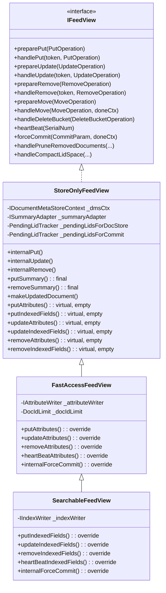

### §1.1 StoreOnlyFeedView — 地基

文件：`searchcore/proton/server/storeonlyfeedview.{h,cpp}`（`h:44-248`，`cpp` 整文件）

它持有**所有写入都需要的最小集合**：

| 成员 | 职责 |
|---|---|
| `IDocumentMetaStoreContext` | GID↔LID 映射、bucket 归属、timestamp |
| `ISummaryAdapter` | 指向 `LogDocumentStore`，负责整行 doc 的序列化落盘 |
| `PendingLidTracker _pendingLidsForDocStore` | 保证 docstore 写入顺序、flush 可见性 |
| `PendingLidTracker _pendingLidsForCommit` | 保证 force-commit 时所有组件都 drain 干净 |
| `_writeService`, `_repo`, `_schema`, `_params` | 线程服务、文档类型库、schema、subdb 参数 |

关键入口：

- `internalPut` (`cpp:230-274`) 顺序调用 `putMetaData → putSummary → putAttributes → putIndexedFields`，后两个在 base 是空实现；
- `internalRemove` (`cpp` 中 `handleRemove`) 做 tombstone 登记 + `removeSummary`；
- `internalUpdate` (`cpp:303-464`) 更复杂，后面 §5.3 专门讲。

它还定义一个小而关键的辅助类 `UpdateScope`（`h:122-135`）：

```cpp
class UpdateScope : public IFieldUpdateCallback {
    const search::index::Schema *_schema;
    bool _indexedFields;
    bool _nonAttributeFields;
    void onUpdateField(stringref name, const AttributeVector *attr) override {
        if (!_nonAttributeFields && (attr == nullptr || !attr->isUpdateableInMemoryOnly()))
            _nonAttributeFields = true;
        if (!_indexedFields && _schema->isIndexField(name))
            _indexedFields = true;
    }
};
```

这块是 §6 bug 分析的起点——它决定了 update 是"纯 attribute 快路径"还是"重建 doc 慢路径"。

### §1.2 FastAccessFeedView — 加入 attribute 写入

文件：`searchcore/proton/server/fast_access_feed_view.{h,cpp}`（`h:17-66`）

在 `StoreOnlyFeedView` 之上新增一个 `IAttributeWriter`。它只 override **attribute 相关**的四个虚函数：

```cpp
// fast_access_feed_view.cpp:22-25
void FastAccessFeedView::putAttributes(SerialNum s, Lid lid, const Document &doc,
                                       OnPutDoneType onWriteDone) {
    _attributeWriter->put(s, doc, lid, onWriteDone);
    _docIdLimit.bumpUpLimit(lid + 1);
}
```

`updateAttributes` 有两个重载：纯 `DocumentUpdate` 形式（常见的 partial update）和 `FutureDoc` 形式（当某些 struct field 需要完整重建 doc 才能拿到新值时）。

`DocIdLimit` 是只增的高水位，搜索侧以此界定"哪些 LID 现在已经有 attribute 数据"。

### §1.3 SearchableFeedView — 加入倒排索引

文件：`searchcore/proton/server/searchable_feed_view.{h,cpp}`（`h:17-64`）

再加一个 `IIndexWriter`，并 override `putIndexedFields / updateIndexedFields / removeIndexedFields / heartBeatIndexedFields`。注意 `putIndexedFields` 的实现（`cpp:43-80`）会把真实工作 `execute()` 到 **index 线程**上：

```cpp
void SearchableFeedView::putIndexedFields(SerialNum serialNum, Lid lid,
                                          const FutureDoc &futureDoc,
                                          OnOperationDoneType onWriteDone) {
    _writeService.index().execute(makeLambdaTask([=, this]() {
        performIndexPut(serialNum, lid, futureDoc, onWriteDone);
    }));
}
```

— 即便调用方在 master 线程，索引的实际插入永远在 index 线程里串行发生（避免锁）。

### §1.4 三层叠加的语义总览

一次 put 经过三层的职责分布：

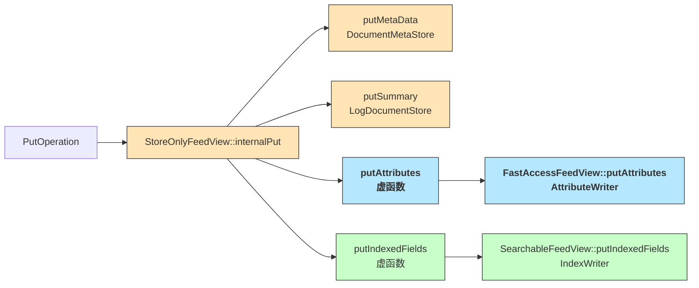

---

## §2 横向 Sub-DB 架构（Ready / NotReady / Removed）

一个 `DocumentDB` 持有三个 `IDocumentSubDB`（`searchcore/proton/server/idocumentsubdb.h:55-126`），分别对应三个文档"状态域"：

| Sub-DB | 目录名 | FeedView | 含义 |
|---|---|---|---|
| Ready | `0.ready` | **SearchableFeedView** | 可搜索、attribute 已加载、index 已构建 |
| Removed | `1.removed` | **StoreOnlyFeedView** | 墓碑，仅存 meta+summary，用于防止误重建 |
| NotReady | `2.notready` | **FastAccessFeedView** | 已写入、但尚未进 ready（冷 attribute、无 index） |

这三者由 `CombiningFeedView` 统一路由（`searchcore/proton/server/combiningfeedview.{h,cpp}`）。它根据 `IBucketStateCalculator` 判定一个 bucket 该进哪个 sub-db，并在 `handleMove` 里把一条 doc 从源 sub-db 迁移到目的 sub-db（例如一个原本 NotReady 的 bucket 变成 Ready 时，就逐条 Move）。

### §2.1 Sub-DB 组件对比

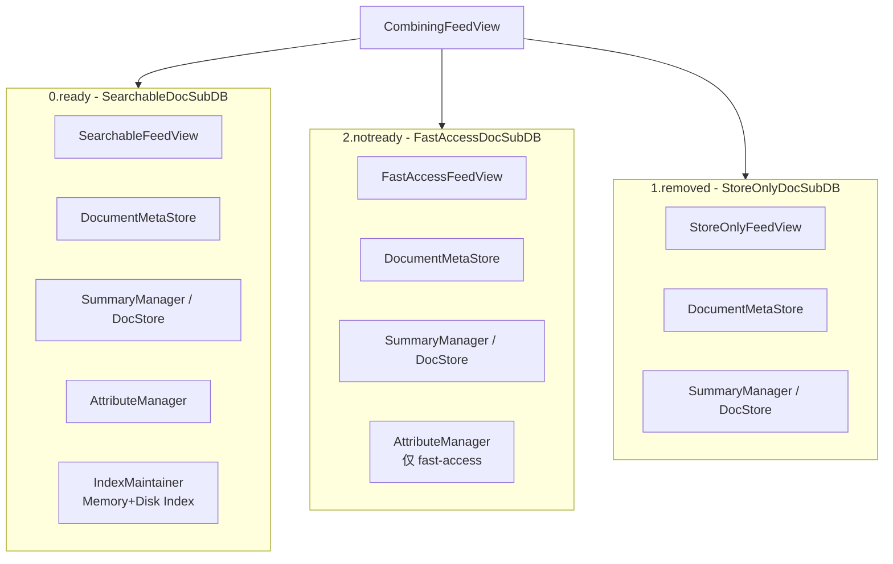

注意到**每个 sub-db 都有自己独立的 DocumentMetaStore 和 DocumentStore**——这是 Vespa 选择"三域物理隔离"的架构决定，带来的好处：

- Ready 和 NotReady 的 LID 空间完全独立，不会因为一个 doc 从 NotReady 迁到 Ready 而引起 LID 空洞；
- Removed 单独留墓碑，不会占用 Ready 的内存 attribute 空间；
- 每个 sub-db 可以独立 flush/compact/fusion。

坏处：一个 put/update 路由错 sub-db 时表现非常诡异（比如把本应 Ready 的文档写进 NotReady，会导致搜索不到却可以 visit），这也是 CombiningFeedView 路由逻辑必须严格测试的原因。

### §2.2 Sub-DB 类的继承

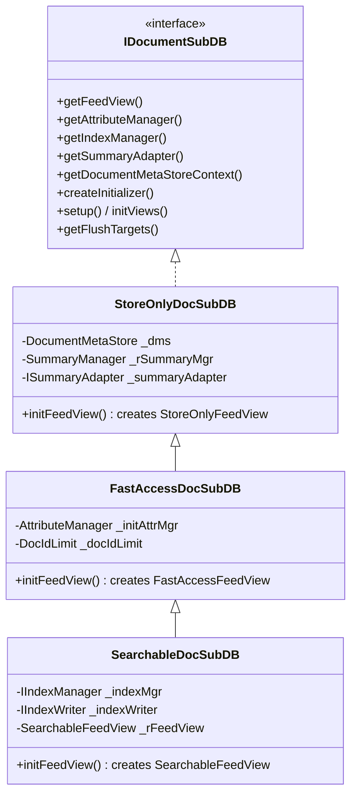

**关键对齐**：Sub-DB 继承关系与 FeedView 继承关系是**一一对应**的。`SearchableDocSubDB::initFeedView()` 会构造一个 `SearchableFeedView`，并把自己持有的 attribute manager / index manager / summary adapter 注入进去。

### §2.3 Move 操作：跨 Sub-DB 的数据搬迁

`MoveOperation` 表达"把 LID X 从 source subdb 迁到 target subdb"。`CombiningFeedView::handleMove`（`combiningfeedview.cpp`）会让**源 subdb 做 remove，目标 subdb 做 put**——两者共享同一个 `onDone` 回调以保证原子性。

典型触发点：

- BucketMoveJob 检测某 bucket 从 not-ready→ready 应该发生（例如 attribute 已预热）；
- Distributor 通知 bucket 从本节点迁出（把数据写进 Removed 作为墓碑）。

---

## §3 核心组件矩阵与线程模型

### §3.1 组件职责矩阵

| 组件 | 文件 | 存什么 | 写入入口 | 持久化 |
|---|---|---|---|---|
| DocumentMetaStore | `proton/documentmetastore/documentmetastore.{h,cpp}` (`h:35-146+`) | LID↔GID、BucketId、Timestamp、DocSize | `put / remove / move` | attribute-style flush + bucketdb |
| LogDocumentStore | `searchlib/docstore/logdocumentstore.h:18-57` | 整行 serialized Document | `put / remove / get` | 顺序追加的 chunk 文件 + bloat/spread compact |
| SummaryAdapter | `proton/server/summaryadapter.{h,cpp}` | LogDocumentStore 的 thin wrapper | `put / remove / get / heartBeat` | 委托给 SummaryManager |
| AttributeManager | `proton/attribute/attributemanager.h:31+` | 全部 AttributeVector 集合 | `getWritableAttribute()` | per-attribute `.dat`+`.idx` |
| IAttributeWriter | `proton/attribute/i_attribute_writer.h:24-68` | 批量路由到每个 attribute field | `put / remove / update / heartBeat / forceCommit` | 委托 AttributeVector |
| IndexManager | `proton/index/indexmanager.h:32+` | MemoryIndex + DiskIndex 集合 + 进行 fusion | `putDocument / removeDocuments / commit / runFusion` | disk index 目录 + fusion |
| IIndexWriter | `proton/index/i_index_writer.h` | MemoryIndex 写入 | `put / removeDocs / commit / heartBeat` | 委托 IndexMaintainer |

### §3.2 线程模型：5 类执行器

文件：`searchcore/proton/server/executorthreadingservice.h:19-91`

| 执行器 | 用途 | 并发度 |
|---|---|---|
| `_masterExecutor` | 所有 prepare/handle 调度入口；单线程保证 serialNum 顺序 | 1 |
| `_indexExecutor` | MemoryIndex 写入；单线程避免词典锁竞争 | 1 |
| `_summaryExecutor` | LogDocumentStore 写入 | 1（可配） |
| `_attributeFieldWriter` | **per-field** 串行，ISequencedTaskExecutor | N（~ CPU 核） |
| `_sharedExecutor` | Doc 重建、makeUpdatedDocument 等可并行任务 | 共享线程池 |

fork-join 图：

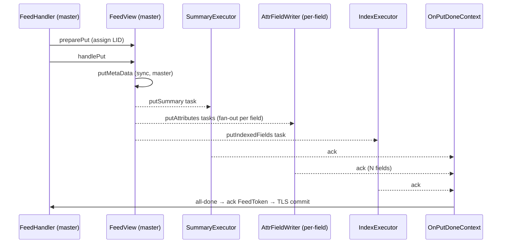

### §3.3 PendingLidTracker 与 commit barrier

`storeonlyfeedview.h:143-144` 持有两个 tracker：

- `_pendingLidsForDocStore`：跟踪"已经发给 summary 线程、但还没真正落到 docstore"的 lid。搜索/visit 拉 doc 时如果 lid 在 pending 集合里，必须等它 drain。
- `_pendingLidsForCommit`：跟踪"整条 put 的 fan-out 还没全部 ack"的 lid。`forceCommit` 必须等它清零。

这套机制是 **write→search 可见性**的关键（§8 会再展开）。

---

## §3.END 中场小结

到这里为止，架构骨架清楚了：

- **纵向**：`StoreOnly → FastAccess → Searchable` 逐层叠加 DocStore → Attribute → Index；
- **横向**：`Ready / NotReady / Removed` 三个 sub-db 分别用其中某一层作为 FeedView；
- **线程**：master fan-out 到 summary/attribute/index 三组 worker，通过 OnDone 汇总；
- **一致性**：PendingLidTracker 负责写入顺序与可见性屏障。

下一章开始，我们拿具体的 `字段类型 × 存储模式` 组合去过这条链路，看看哪些分支真正被激活。

---

## §4 字段类型 × 存储模式 组合矩阵

### §4.0 基础认知

Vespa schema 把每个 field 的"去向"分成三个可叠加的 target：

| Target | 含义 | 存储介质 |
|---|---|---|
| **index** | 构建倒排索引、支持全文检索/term match | MemoryIndex → DiskIndex（fusion 合并） |
| **attribute** | 构建列式内存结构、支持 filter/rank/grouping | AttributeVector（mmap 的 `.dat/.idx`） |
| **summary** | 出现在查询返回体里 | LogDocumentStore |

一个 field 可以是 `index`，或 `attribute`，或 `summary`，或任意组合，或都不是（只写 TLS 做异地冷备的场景）。**但是**这里有一条隐含规则：

> **只要 field 出现在 summary 里，整行 doc 必须序列化进 DocumentStore**——哪怕它同时是 attribute/index。
> 这是因为 DocumentStore 按"整行"存，不是按字段存。

这条规则是 §6 bug 的根源。

字段类型则有 7 类：`primitive / array / weighted-set / map / struct / tensor / reference`。下面按类型展开。

### §4.1 Primitive（int, long, float, double, bool, string）

最常见的 8 种"目标模式组合"：

| # | index | attribute | summary | 代表用途 | 激活路径 |
|---|---|---|---|---|---|
| 1 | — | — | ✓ | 日志原文 | DocStore only |
| 2 | — | ✓ | — | 仅 filter | Attribute only |
| 3 | ✓ | — | — | 纯全文检索 | Index + DocStore（summary 派生） |
| 4 | — | ✓ | ✓ | 带返回的 filter 字段 | Attribute + DocStore |
| 5 | ✓ | — | ✓ | 显示原文的全文检索 | Index + DocStore |
| 6 | ✓ | ✓ | — | 不返回但需检索+排序 | Index + Attribute + DocStore（隐式 summary） |
| 7 | ✓ | ✓ | ✓ | 最常用：全文检索+rank+返回 | 全路径 |
| 8 | — | — | — | — | 几乎无意义（只落 TLS） |

**注意表里的"隐式 summary"**：即便 schema 没写 `summary`，整行 doc 依旧会进 DocumentStore，因为 update/reindex 都可能要求从 DocumentStore 重建整个 doc。只是"查询返回"时不会出这个字段。

#### §4.1.a 组合 1：`field x type string { summary }`

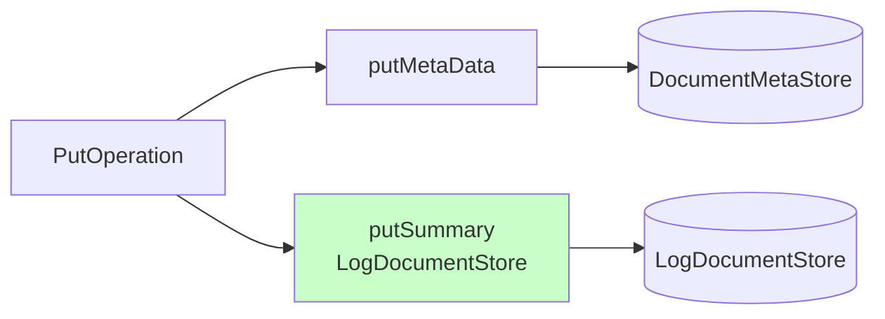

- 写入链路：只进 DocMetaStore 和 DocStore。
- **读取**：必须从 LogDocumentStore deserialize 整行 doc 再取字段。

#### §4.1.b 组合 2：`field price type int { attribute: fast-search }`

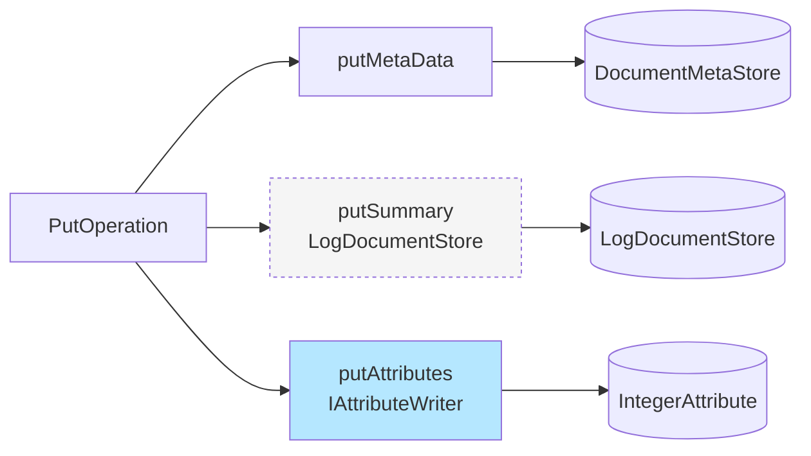

- **注意 DocumentStore 仍被写**（虚线框提示"内容只有 header，字段值是冗余的"）。如果 schema 启用了 `match: fast-access` 而不把字段列为 summary，docstore 里这字段的值可以从 attribute 派生，但**整行 doc** 仍然要存（见 §4.0 规则）。
- AttributeWriter 把单字段路由给对应的 `_attributeFieldWriter` 执行器（按 field-name hash 到某一线程），保证**同一 field 的写入严格串行**。

#### §4.1.c 组合 3：`field body type string { indexing: index }`

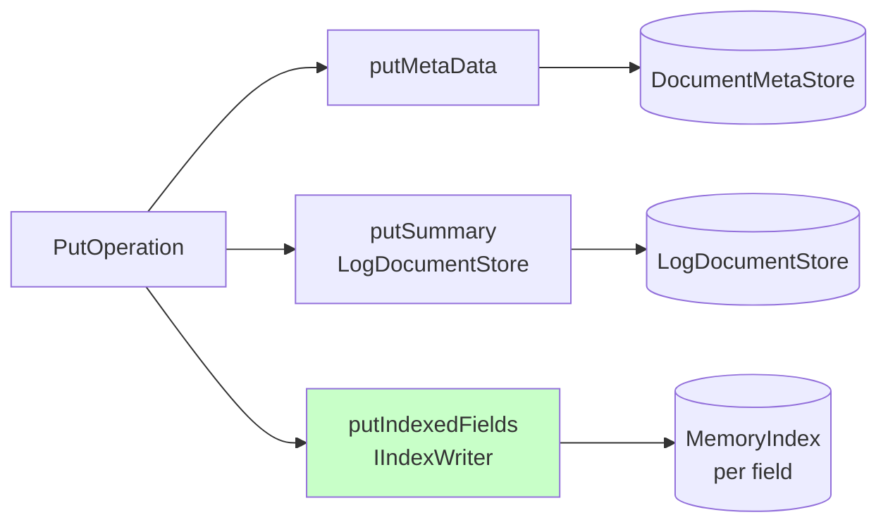

- IndexWriter 把任务 `execute()` 到 **indexExecutor** 线程。MemoryIndex 内部按 field 划分，每个 field 有自己的 WordStore+PostingList。
- 因为 summary 没声明，DocumentStore 仍然写整行（supporting reindex、update、get）。

#### §4.1.d 组合 4：`field user_id type long { attribute | summary }`

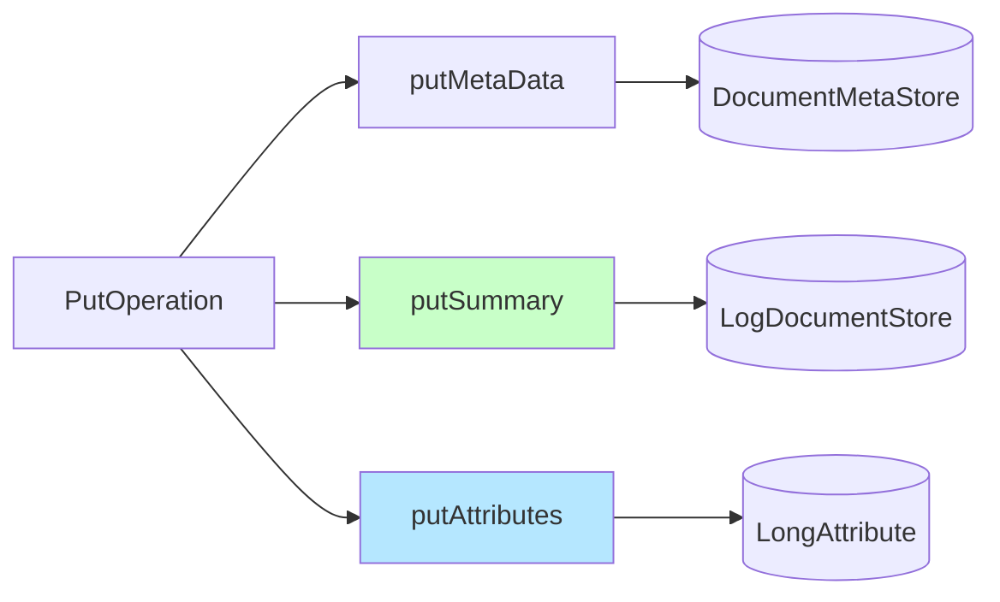

- 和组合 2 结构一样，但 docstore 这次是"正常"被使用（读取路径可能直接从 attribute 取；也可能从 docstore 取。取决于 summary class 配置）。

#### §4.1.e 组合 5：`field body type string { index | summary }`

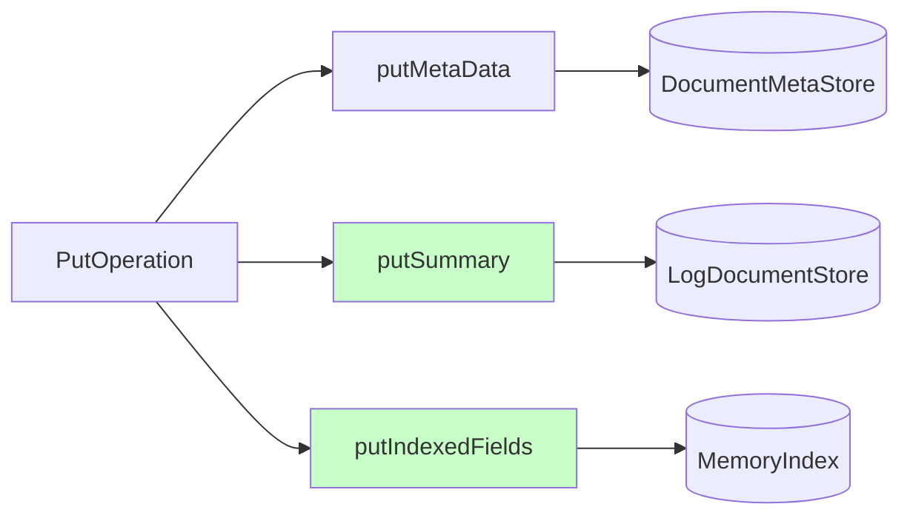

- 最常见的全文检索场景。summary 可能是 `dynamic summary`（extract snippet），需要从 DocStore + 索引 posting 位置共同渲染。

#### §4.1.f 组合 6：`field title type string { index | attribute }`

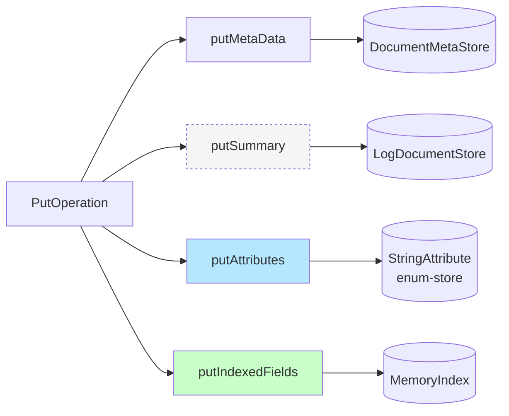

- 最"重"的写入组合之一：**三条 worker 线程同时工作** + 一条 master。
- 注意 String attribute 用 enum-store 做去重：写入时做哈希查表，多条 doc 共用同一个 enum 值，节省内存但增加写入 CPU。

#### §4.1.g 组合 7：`index | attribute | summary`

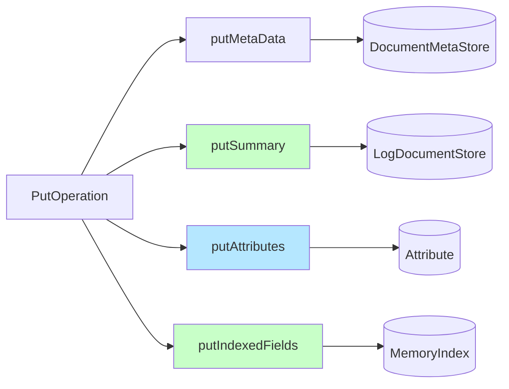

- 一个 put 扇出到 4 条线程。写入吞吐由**最慢的一条**决定——通常是 indexExecutor（词典互斥 + posting merge）。

#### §4.1.h 组合 8：`indexing: ""`（都不是）

实际中罕见。意义：字段只存在 TLS 里，供 replay 时带到可能后加的 schema 扩展。**FeedView 层不会执行任何 put 分支**，但 DocStore 仍然会写整行 doc（因为 DocStore 是按 doc 粒度，不按 field）。

### §4.2 Array / WeightedSet

`array<int>`、`weightedset<string>` 等**多值字段**在写入路径上和 primitive 一样走 `putAttributes`，但 AttributeVector 内部存储方式不同：

```
MultiValueMapping：
  docId → valueRange offset → 实际 value 数组
```

写入步骤：

1. AttributeWriter 拿到整个 Document；
2. 对该字段构造 `vector<Value>`；
3. 调用 `MultiValueAttribute::setValues(lid, values)`；
4. MultiValueMapping 分配一段新 range（旧 range 交给 GenerationHolder）。

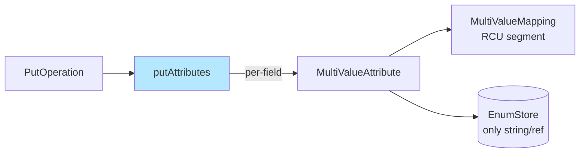

**关键代价**：多值字段的 update 操作（`addElements`、`removeElements`）要读出旧 range、计算新 range、写入新 range，O(n) 复制。超大的 weightedset 是写入延迟的常见源头。

### §4.3 Map

Vespa schema 中 `map<K,V>` 在内部被**编译成两列 attribute**：`mapfield.key` 和 `mapfield.value`，都用 array 实现，且共用同一个 `docId → range` 结构。

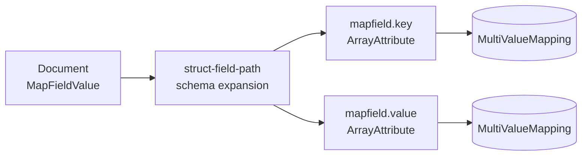

**更新特性**：map 支持对单个 key 做 partial update（`{"field{mykey}": {"assign": 42}}`）。AttributeWriter 会定位到该 key 在 value 数组中的 index，做**in-place** 修改——这条路径是写入最快的之一（§6 快路径）。

### §4.4 Struct / Complex

Struct field 的 attribute 化依赖 **struct-field-path**：只有被声明为 `struct-field x.y { indexing: attribute }` 的内层标量才真正走 AttributeVector。其他内层字段仅存在于 DocumentStore 的整行 doc 里。

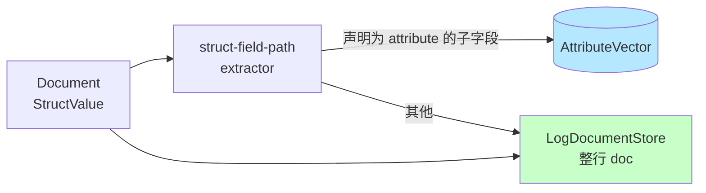

**一个重要细节**：对 struct 做 partial update 时，如果某个非 attribute 子字段被修改，就必须**从 DocStore 读出整行 doc，修改后重写**——这条路径在 `makeUpdatedDocument` 里（`storeonlyfeedview.cpp:467-499`），是 update 慢路径。此时 `UpdateScope._nonAttributeFields` 会被置 true。

### §4.5 Tensor

Tensor 字段的特殊性：**只能是 attribute，不能 index**。两种存储方式：

- **Dense tensor**：按固定维度打包成 `vector<double/float/int8>`；
- **Sparse / mixed tensor**：稀疏坐标 + 值。

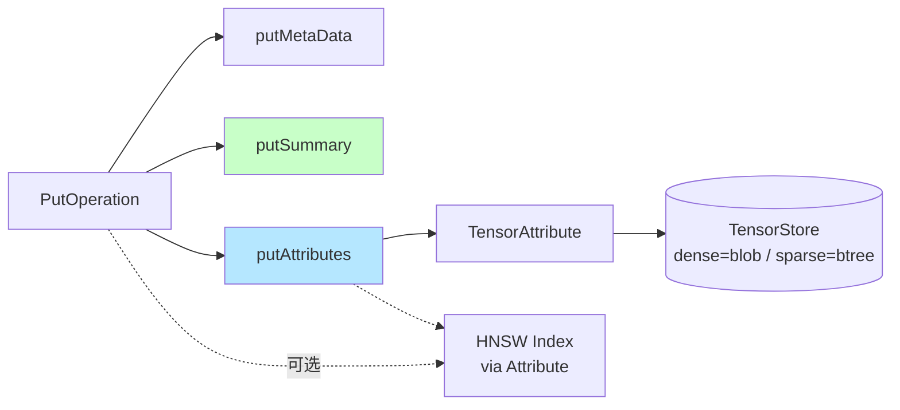

如果 tensor 声明了 `index { hnsw }`，写入还会触发**HNSW 图的插入**——这条路径由 AttributeWriter 在完成 attribute 写入后调用 `TensorAttribute::prepare_set_tensor` + `complete_set_tensor`，中间是可以部分并行的（HNSW 构建是 CPU 热点之一）。

### §4.6 Reference（parent-child imported field）

`reference<parent_type>` 字段：

- 写入父类型时走正常路径，无特殊；
- 子类型里 `import field parent.foo as foo` 的 **imported attribute** **不产生写入路径**——它在 search 时按需从父 attribute 读；
- Reference 字段本身是 attribute（存 GID），写入时除了 attribute 还要通知 `ReferenceStore` 维护一个 GID→LID 的索引（供 imported field 解引用）。

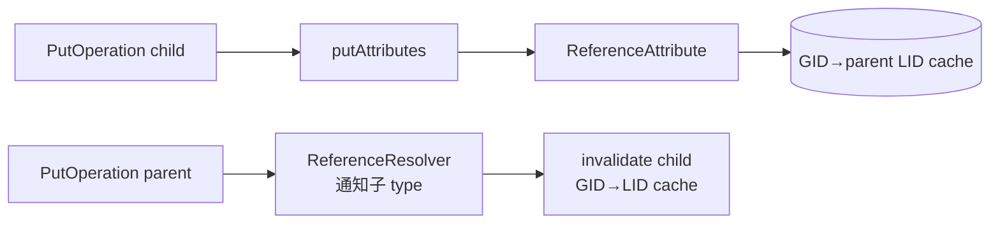

父侧的 put 会通过 `DocumentDBReferentRegistry` 通知子 DocumentDB 失效缓存——这在跨 DocumentDB 的 put 中引入一条**耦合**，工程上需要注意。

### §4.7 组合矩阵总览

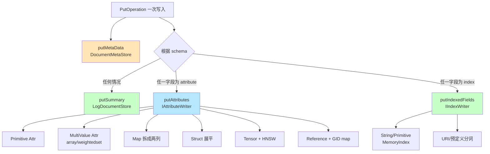

**核心观察**：

1. **DocumentMetaStore 与 DocumentStore 是"一定写"**——只要有 put。
2. **Attribute 路径按字段数量横向 fan-out**——同一个 doc 的不同 attribute field 在不同线程上并行写。
3. **Index 路径永远落在单个 indexExecutor**——这是写入瓶颈的常见位置。
4. **Map / Struct / Tensor 引入额外的 in-memory 数据结构维护**，读写代价都比 primitive 高一个量级。

---

## §5 写入时序：Put / Update / Remove / Move

### §5.1 Put：从 FeedHandler 到所有组件的完整时序

一次 put 的生命周期横跨 RPC 线程、master 线程、3 组 worker 线程、TLS 线程。下面这张图按时间从上到下展开：

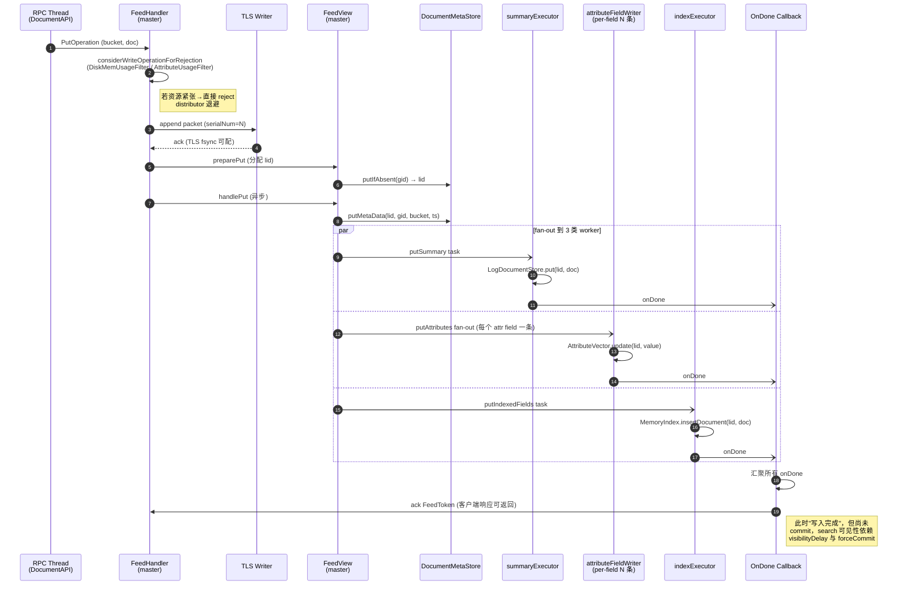

**关键点**：

- **TLS 写在最前面**——保证任何后续操作都可在 crash 后 replay；
- **DocumentStore / Attribute / Index 的 fan-out 是完全并行的**，互相不等待；
- **OnDone 是计数回调**，所有 worker 都 ack 后才向 client 返回成功；
- **ack 不等于 search 可见**：可见性要等 `forceCommit`（或 `visibilityDelay` 触发的 auto-commit）把 RCU generation 推进。

### §5.2 Remove：墓碑化 + 惰性 LID 回收

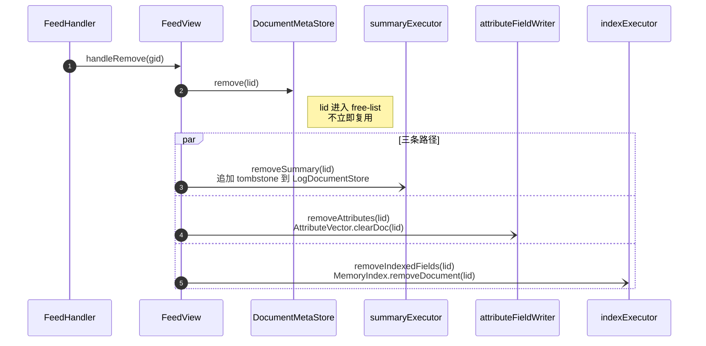

- DocumentStore 的 remove 不立刻回收磁盘空间，只追加一条"removed"记录，待 bloat 阈值到再 `compactBloat` 合并；
- AttributeVector 的 `clearDoc` 把该 lid 的值置为默认（或 null），不回收内存；
- MemoryIndex 的 remove 把 lid 加入该 field 的 `_removedDocs` 位图，查询时做过滤，真正从 posting list 去掉等 flush→disk + fusion。

### §5.3 Update：三条路径的分叉

文件：`storeonlyfeedview.cpp:303-464`。这是最复杂的一条路径。

```mermaid
flowchart TB
    U[UpdateOperation] --> S[用 Schema+AttributeManager<br/>构建 UpdateScope]
    S --> CHK{updateScope.<br/>_indexedFields 或<br/>_nonAttributeFields ?}

    CHK -->|都是 false<br/>纯 attribute 快路径| FAST[updateAttributes<br/>直接 in-place 修改]
    FAST --> DONE1[OnDone → ack]

    CHK -->|true| SLOW[慢路径]
    SLOW --> READ[shared().execute<br/>makeUpdatedDocument]
    READ --> GET[SummaryAdapter.get lid<br/>从 DocStore 读整行 doc]
    GET --> APPLY[apply DocumentUpdate<br/>到 prevDoc]
    APPLY --> SER[重新 serialize]
    SER --> FUT[填充 FutureDoc + FutureStream]
    FUT --> FO1["updateIndexedFields<br/><b>整 doc 全部 indexed field 重索引</b><br/>💥 N× 写放大"]
    FUT --> FO2[updateAttributes<br/>struct field path]
    FUT --> FO3[putSummary<br/>写回整行 doc]
    FO1 --> DONE2[OnDone → ack]
    FO2 --> DONE2
    FO3 --> DONE2

    style FAST fill:#C8FFC8
    style SLOW fill:#FFD4D4
    style FO1 fill:#FFAAAA
```

**快路径（左分支）**：只有一条 fan-out，只动 attribute。写入延迟可以低到微秒级。  
**慢路径（右分支）**：有一次 DocStore **读**（随机 IO）+ 反序列化 + 重新应用 update + 再序列化 + DocStore **写**，**外加**整 doc 所有 indexed field 的 reindex（详见 §5.5）。延迟是快路径的几十倍到上百倍。

因此**识别 update 是否进入快路径**是工程优化的关键。代码锚点：

- `UpdateScope::onUpdateField`（`storeonlyfeedview.h:125-133`）——**每个被 update 的 field 都会调用一次**。只要有一个 field 不是 `AttributeVector::isUpdateableInMemoryOnly()`，就置 `_nonAttributeFields=true`；只要有一个 indexed field 被 touch，就置 `_indexedFields=true`；
- `isUpdateableInMemoryOnly` 对于 tensor、enum-based string、HNSW 都可能返回 false；
- **一个典型坑**：给 string 字段加上 `match: substring` 或改变 dictionary 类型，会让原本快路径的 update 突然变慢。
- **另一个更隐蔽的坑（§5.5）**：哪怕只是动了一个 indexed field，整 doc 的所有 indexed field 都被重新 tokenize + 写 posting。

### §5.4 Move：跨 Sub-DB 搬迁的两端写

`CombiningFeedView::handleMove` 一个 MoveOperation 变成"源 subdb remove + 目标 subdb put"：

```mermaid
sequenceDiagram
    participant CFV as CombiningFeedView
    participant SRC as Source SubDB<br/>(e.g. NotReady)
    participant DST as Target SubDB<br/>(e.g. Ready)
    participant BKT as BucketDB

    CFV->>DST: put(lid', gid, bucket, doc)
    Note over DST: 目标 subdb 的 FeedView<br/>执行完整 putAttributes<br/>+ putIndexedFields
    CFV->>SRC: remove(lid)
    Note over SRC: 源 subdb 的 FeedView<br/>清除 attr + index + docstore
    CFV->>BKT: 更新 bucket 的 subdb 归属
```

两侧共享同一个 `OnDone`，避免中间状态被外部观察。

### §5.5 Update 慢路径的隐藏写放大

**这是 Vespa 设计里最容易让人误解的地方**：API 是 partial update，看似只动一个字段；但是只要落入慢路径，**整 doc 的所有 indexed field 都会被重新 tokenize 并写 posting list**。partial 在 API 层是 partial，在 index 写入层是 full。

#### 写放大量化

```mermaid
flowchart LR
    U["UpdateOperation<br/>只动 1 个 field"] --> SLOW[慢路径]
    SLOW --> DSREAD["DocStore.get(lid)<br/>读整行 doc"]
    DSREAD --> APPLY["apply update<br/>得到 newDoc"]
    APPLY --> IDX["index reindex<br/>遍历 schema 全部 N 个 indexed field"]
    APPLY --> DSWRITE["DocStore.put<br/>写整行 newDoc"]
    APPLY --> ATTR["attribute update<br/>(touched 字段)"]

    IDX --> F1["field 1: tokenize + posting"]
    IDX --> F2["field 2: tokenize + posting"]
    IDX --> FN["... field N: tokenize + posting"]

    style IDX fill:#FFAAAA
    style F1 fill:#FFD4D4
    style F2 fill:#FFD4D4
    style FN fill:#FFD4D4
```

假设 doc 有 10 个 indexed field，理想 partial 成本 C/10：

| 路径 | Index CPU | DocStore IO | 写放大 |
|---|---|---|---|
| 期望 partial | C/10 | 0 | 1× |
| Vespa 实际慢路径 | **C** | 整行读 + 整行写 | **10×** |
| Vespa 快路径（attr-only） | 0 | 0 | 0 |

#### 为什么必须这样做：跨字段一致性

不是设计疏忽，而是**搜索一致性的强制要求**。完整原因有 5 个层面：

1. **MemoryIndex 数据结构没有 per-field-per-lid 版本号**。一个 lid 的所有字段共享同一个 `_removedDocs` bitmap 和同一个 generation。要做 per-field 增量，等于在每个 posting entry 里多带 fieldGen 字段——全局结构改造。

2. **跨字段查询（fieldset / multi-field BM25F）**需要 lid 在所有相关 field 上呈现"同一时刻快照"。允许 per-field 增量后，`f1` 取自 t1 状态、`f2` 取自 t2 状态，rank 信号基于一个**逻辑上从未存在过的 doc**计算，会出现幽灵 hit。

3. **Source blender / 跨 source 合并**：MemoryIndex shard、DiskIndex shard 在查询时由 source blender 合并。每个 source 内部 doc 必须自洽，否则 blend 出 Frankenstein 结果。

4. **Phrase / NEAR / 位置算子**依赖 token positions。Position 是按"整 doc 一次 tokenize"的维度组织的，部分更新位置容易越界或穿插。

5. **Snippet / bolding 重建**：原文从 docstore 取，高亮位置从 index posting 取。两者时间线必须对齐。

#### 这条规则的工程含义（电商场景特别重要）

- **schema 上每多加一个 indexed field，每条 update 的潜在最坏代价 ×N**。给 indexed field 加 `match: substring`、`tensor index`、`stemming`、`gram` 都会让单字段 reindex 成本本身也变贵；
- **快路径 vs 慢路径的代价是悬崖式跳变，不是连续的**：触发条件是"任一字段不满足 in-place 条件"。业务方加一个 `index: name` 看似无害，实际把整条 update 路径成本提一个数量级；
- **`_docStoreFields` 那类优化（§6）即使逻辑写对，也只能省下"读+写整行 doc"那部分**，省不了 reindex 的 N×。所以那次回滚某种意义上"少干了一半"。

#### 何时这条规则可以放松（编译期判定）

并非所有 schema 都需要跨字段一致性。如果一个 indexed field 满足：
- 不参与任何 fieldset；
- 不参与跨字段 phrase / proximity；
- 不被 BM25F 类多字段 ranking profile 用到；
- 没有自定义 rank expression 同时引用它和其他字段；

理论上可以 per-field 独立 reindex（§11.B5 详述）。但 Vespa 主线没有这个判定——保守起见全部 reindex。

---

## §6 Bug 解读：attribute 字段与 docstore 的纠缠

你回忆的那个 bug："某字段如果是 attribute，就不更新 docstore，结果出问题了。"——这是一个**非常典型的错误推广**。本章把正确语义、错误模式、正确修复方向讲透。

### §6.1 正确语义

**规则 1（硬性）**：只要一次 put 提交了完整 Document，`LogDocumentStore` 就必须收到这份 doc。原因：

- Document 是**整行存储**，不按字段存；
- 未来的 update、reindex、migrate、visit 都可能需要完整 doc 来重建其它组件；
- Summary 渲染时，对于没有 attribute 表达的字段（比如大 string、非 attribute 的 struct 子字段）只能从 docstore 拿。

**规则 2（优化）**：summary 渲染时，如果字段同时是 attribute，runtime 可以选择**从 attribute 读**而不从 docstore 读（节省一次反序列化）。这条优化由 `DocumentRetriever` 决定，**与写入路径无关**。

代码锚点：

- `DocumentRetriever`（`proton/server/documentretriever.h:17-64`）里维护 `FieldSetAttributeDB`，判断一个 field set 是否"全部 attribute-only"；
- 若是，`retrieve()` 走 attribute 快读，跳过 `_summaryAdapter->get(lid)`；
- 若否，`_summaryAdapter->get(lid)` 必须从 docstore 读。

**结论**：docstore 是真源（source of truth for document body），attribute 是"热副本"。写入时不能跳过真源，读取时可以选择热副本。

### §6.2 错误模式（可能就是你当时踩的坑）

假设读代码时看到 `DocumentRetriever` 里有"字段全是 attribute 就跳过 docstore"的逻辑，然后把这条规则错误地搬到**写入路径**：

```cpp
// 错误修改：
void StoreOnlyFeedView::internalPut(...) {
    putMetaData(...);
    if (!allFieldsAreAttributes(doc)) {      // ← 新增的错误判断
        putSummary(serialNum, lid, doc, onWriteDone);
    }
    putAttributes(serialNum, lid, *doc, onWriteDone);
    putIndexedFields(serialNum, lid, doc, onWriteDone);
}
```

**表现**：

| 操作 | 现象 |
|---|---|
| Put（all-attr doc） | 静默成功，但 DocStore 里没这条 doc |
| Get / Visit | 查不到 doc body，只拿到 attribute 值 |
| Update（带非 attr 字段） | `makeUpdatedDocument` 里 `summaryAdapter->get(lid)` 返回 `nullptr`，要么 crash 要么写入"空 doc + update"的残缺 |
| Remove | 正常（remove 只需 meta） |
| Reindex / schema 改动 | 没有 doc body 可重建，Ready/NotReady 相互迁移时丢数据 |
| Fusion 后 get | 彻底丢 |

### §6.3 为什么这条规则看起来"好像对"

诱惑力在于：**如果整个 schema 里所有字段都是 attribute**，理论上 doc body 确实可以从所有 attribute 拼回来。Vespa 支持这种"attribute-only"的 summary class。但有两个陷阱：

1. **即便现在所有字段都 attribute**，update 来一次新字段（版本兼容）就破坏前提；
2. **Struct / Tensor / Map** 的 attribute 化只覆盖声明过的子字段，未声明的内层字段**只在 docstore 里**——"all-attribute"的判断极容易漏掉这些隐式依赖。

### §6.4 正确的"跳过 docstore" 的优化空间

真正合法的跳过场景只有一个：**attribute-only partial update**。也就是 §5.3 的 update 快路径。此时：

- 没有读 DocStore（`makeUpdatedDocument` 不调用）；
- 没有写 DocStore（`putSummary` 不调用）；
- 只更新 attribute 的值；
- doc body 在 DocStore 里依然是**旧版本**，但 summary 渲染时 `DocumentRetriever` 会用 attribute 的新值覆盖——这是一致的。

代码锚点：`storeonlyfeedview.cpp:303-464` 的 `internalUpdate`。你可以搜 `updateScope.hasIndexOrNonAttributeFields()`（或等价判断），它的 **false 分支**就是快路径。

**扩展这条路径的方法**（§11 会再展开）：

1. 让更多字段声明为 attribute（降低 `_nonAttributeFields=true` 的概率）；
2. 让 `AttributeVector::isUpdateableInMemoryOnly()` 对更多 attribute 类型返回 true（例如 in-place tensor modify）；
3. Map 的 `{key}` partial update 已经是 in-place 快路径，可以显式把热点字段建模成 map；
4. Struct field-path 级 attribute 可以让部分 struct update 走快路径。

### §6.5 一段有意思的观察：replay 时没这个 bug

因为 TLS 里存的是完整 `DocumentUpdate` / `Put` 的序列化形式。Replay 时 FeedHandler 会**重放完整 op**，进入和正常写一样的 FeedView 路径。如果你的错误修改逻辑是在写入路径上跳过 docstore，replay 后也会**复现**这个问题——**不是 crash recovery 就能救回来**。这也是当年这类 bug 难发现的原因：测试集里单条 put+get 过得去，一碰 update + restart 就炸。

### §6.6 真实案例复盘：`_docStoreFields` 字段集过滤

业界有过一个实际尝试（这里以"MR !563"代称，后被 MR !568 回滚）：试图在 update 慢路径里，**按字段过滤**哪些字段写回 docstore。实现大致：

```cpp
// 构造时（schema 加载阶段）：
_docStoreFields = 所有字段 - isAttributeField 的字段
// 推理：attribute field 可以从 attribute 读回，docstore 不需要存

// update 路径的 makeUpdatedDocument:
newDoc = make_unique<Document>(*_repo, *_docType, update.getId());  // 从零构造
for (fieldUpdate : update.getUpdates()) {
    if (_docStoreFields.contains(field.getName())) {
        fieldUpdate.applyTo(*newDoc);
    }
}
// 然后只把 _docStoreFields 里的字段从 prevDoc 拷过来
```

**它为什么坏**——精准对应 §6.2 的错误模式：

| 字段类型 | 写入行为 | 读取后果 |
|---|---|---|
| 纯 indexed（非 attribute） | 在 `_docStoreFields` 里 → apply update + 拷 prevDoc → 正常 | OK |
| `attribute` only | 不在 `_docStoreFields` 里 → 跳过 → docstore 缺字段 | summary 渲染缺字段（除非 summary 配了 source: attr） |
| `attribute + index`（电商最常见） | **不在 `_docStoreFields` 里** → 跳过 → docstore 缺字段 | summary 渲染缺字段，且 reindex 时如果换 schema 会丢 |
| `attribute + summary` | 跳过 → docstore 缺字段 | summary 渲染依赖 retriever 的 attribute fallback，不稳定 |

根因：`isAttributeField()` 的语义是"该字段在 attribute 里有一份"，**不等于**"summary 渲染会从 attribute 读"。Vespa 的 summary 默认走 docstore（除非 schema 里写了 `summary X { source: attribute_name }`），所以"是 attribute" 不构成 "可以跳过 docstore"。

**回滚后的最简正确版**（MR !568）：

```cpp
newDoc = std::move(prevDoc);          // 全字段保留
if (useDocStore) {
    update.applyTo(*newDoc);          // 全量 apply
    newDoc->serialize(newStream);     // 全字段写回
}
```

正确但**不做任何优化**。

#### 这个案例真正的教训

1. **判定维度错了**：不应该按"字段是否是 attribute"判定，而应按"该字段是否被 summary/docstore 读路径需要"判定。后者要看 schema 的 summary class 配置 + rank profile + 哪些 access path 用到。
2. **粒度错了**：字段级过滤会导致 doc 的中间状态（部分字段是新、部分字段是旧）写入 docstore——任何后续 reindex / migrate / cross-schema-evolution 都会暴露。正确粒度是**整 update 级判定**：要么全跳过 docstore（when no field needs docstore），要么走完整慢路径不裁剪。
3. **优化范围被高估**：即使逻辑对，省下的只是 docstore IO 那部分；§5.5 揭示的 N× 索引写放大它根本没碰。所以这个优化在最好情况下也只解决问题的一半。
4. **测试不充分**：这种 bug 在 "put → get" 的单元测试覆盖不到，必须用 "put → update(touch attr field) → get / restart-then-get" 的组合用例才能触发。Vespa 主线 acceptance test 里这种组合应该补齐。

#### 正确版的 schema-aware 优化（详见 §11.A8 + §11.B5）

要重做这个优化，正确路径是：

```text
schema 加载时静态分析：
  needs_docstore[F] = 
       (F 在某 summary class 中且该 class 没有 source: 重定向)
    OR (F 是 indexed 且没有原文重建的 attribute 副本)
    OR (F 有非 attribute 子字段)

update 路径（整 update 级）：
  if ∀ touched F: NOT needs_docstore[F]:
      skip makeUpdatedDocument 全部
      skip putSummary
      只走 updateAttributes
  else:
      正常慢路径，全字段 apply（不做字段裁剪）
```

注意第一个分支的命中条件已经接近 §5.3 的"attr-only fast path"——如果同时所有 touched field 又都是 in-memory updateable，本质就是 fast path。所以这个优化的真正增量是：**对部分 touched 字段是 attribute 但 attribute commit 较重的场景，省下 docstore 一侧的 IO**。增量收益小，工程复杂度大——这也是为什么 Vespa 主线一直没采纳类似优化。

---

## §7 Flush / Fusion / Compact 与写入的耦合

### §7.1 Flush 的整体调度

`FlushEngine`（`searchcore/proton/flushengine/flushengine.{h,cpp}`）负责协调所有可 flush 组件。每个 sub-db 暴露一组 `IFlushTarget`：

| FlushTarget | 所属 | 触发条件 | 产物 |
|---|---|---|---|
| `DocumentMetaStoreFlushTarget` | 每个 sub-db | dirty LID 数超阈值 / 间隔时间 | `.dat/.idx` meta 文件 |
| `SummaryFlushTarget` | 每个 sub-db | LogDocumentStore bloat 或定时 | 新 chunk 文件 + offset 索引 |
| `FlushableAttribute` | Ready/NotReady 的每个 attribute | memory 阈值 / 间隔 | per-attr `.dat/.idx` |
| `IndexFlushTarget` | Ready 的 IndexManager | MemoryIndex 超阈值 | 新 DiskIndex 分片 |
| `IndexFusionTarget` | Ready | 多个 DiskIndex 分片 | 合并成单个 DiskIndex |
| `ShrinkLidSpaceFlushTarget` | 每个 sub-db | LID 空间 fragmentation | 压紧 LID |

**调度策略**文件：`flushengine/prepare_restart_flush_strategy.cpp` 等。优先级按"内存回收效率"排序：一次 flush 能释放多少 dirty 页。

```mermaid
flowchart LR
    FE[FlushEngine<br/>定时唤醒] --> COLLECT[收集所有 IFlushTarget]
    COLLECT --> RANK[按策略排序<br/>memory/age/priority]
    RANK --> PICK[挑选一个或几个]
    PICK --> EXEC[在独立线程执行 flush]
    EXEC --> TASK1[DocumentMetaStore]
    EXEC --> TASK2[SummaryStore]
    EXEC --> TASK3[Attribute]
    EXEC --> TASK4[Index Memory→Disk]
    EXEC --> TASK5[Index Fusion]
    EXEC --> TASK6[ShrinkLidSpace]
    TASK1 --> PRUNE[更新 prunedSerialNum]
    TASK2 --> PRUNE
    TASK3 --> PRUNE
    TASK4 --> PRUNE
    PRUNE --> TLS[TLS prune]
```

Flush 完成后，更新该组件的 `flushedSerialNum`。TLS 只会 prune 到**所有组件**都 flush 过的最小 serialNum——也就是"最慢的那个人决定 TLS 的大小"。

### §7.2 Memory Index → Disk Index 的双缓冲

IndexMaintainer 的写入是典型的 **LSM-like** 结构：

```mermaid
flowchart LR
    W[写入] --> M1[MemoryIndex<br/>active]
    FLUSH[触发 flush] -.switch.-> SWAP{交换}
    SWAP --> M2[MemoryIndex<br/>new active]
    SWAP --> FROZEN[MemoryIndex<br/>frozen]
    FROZEN --> DISK[DiskIndex fragment]
    DISK --> FUSION[多个 DiskIndex]
    FUSION --> MERGED[单一合并 DiskIndex]
```

- Flush 开始时**不阻塞写入**：新写入进 `new active`，旧的 frozen 继续在 serialize 到 disk；
- 搜索时 merge 所有当前 MemoryIndex + 所有 DiskIndex fragment + frozen；
- Fusion 把多个 DiskIndex 合成一个，是**后台 IO 密集 + CPU 密集**任务，会显著挤占写入带宽。

### §7.3 Attribute Flush 的 generation guard

Attribute flush 不是复制整个内存，而是：

1. **take guard**：记录当前 generation；
2. 开始序列化当前数据结构；
3. 此时继续写入，产生新 generation 的数据，但旧 generation 被 guard 保留；
4. 序列化完成后 release guard，GenerationHolder 回收旧数据；
5. 更新 flushedSerialNum，写 metadata 文件。

文件：`vespalib/util/generationhandler.{h,cpp}`、`vespalib/util/rcuvector.h`。

### §7.4 DocumentStore 的 compaction

`LogDocumentStore` 是"追加-only chunk file + offset index"。remove / update 造成 bloat：

- `compactBloat`：遍历 chunk，把非废弃的 doc 复制到新 chunk，旧 chunk 删除；
- `compactSpread`：按 bucket 重新组织 chunk 布局（提升 get-by-bucket 的 locality）。

两者都是后台任务，读写会和它们**竞争磁盘 IO**——当写入吞吐大到让 bloat 快速增长时，compaction 可能跟不上。

### §7.5 ShrinkLidSpace：LID 压缩

当一个 sub-db 经历大量 remove 后，LID 空间出现空洞（`docIdLimit` 虚高）。`ShrinkLidSpaceFlushTarget` 触发 `handleCompactLidSpace`（`storeonlyfeedview.cpp:758-779`）：

- 通知 DocumentMetaStore shrink metadata 数组；
- 通知每个 AttributeVector shrink；
- 通知 IndexMaintainer shrink bitmap；
- 通知 DocumentStore 更新 offset 索引上限。

**与写入的耦合**：ShrinkLidSpace 只在 `docIdLimit` 之后的 LID **确保无未完成写**时才能执行——依赖 PendingLidTracker。

### §7.6 Fusion 期间的 serialNum 边界

Fusion 把 DiskIndex_A（覆盖 serialNum ≤ S1）和 DiskIndex_B（S1+1..S2）合成新 DiskIndex_M（≤ S2）。关键约束：

- Fusion 期间**写入继续进 MemoryIndex**，不影响；
- 生成的 DiskIndex_M 文件原子替换旧的 A、B；
- **searcher 在切换点需要一次 snapshot 切换**，短暂内存峰值（A+B+M 同时驻留）。

---

## §8 读写互相影响：RCU、Generation、可见性延迟

这一节回答"一次写什么时候能被搜索看到，在这之间读和写互相怎么影响"。

### §8.1 无锁读的底层：GenerationHandler + RcuVector

代码锚点：

- `vespalib/util/generationhandler.h:16-141`
- `vespalib/util/rcuvector.h:34-100`

读侧流程：

```cpp
// 伪代码
{
    auto guard = genHandler.takeGuard();   // 记录当前 generation G
    const auto* snap = rcuVec.load();       // 读到 G 时刻的数组基址
    for (auto id : ids) use(snap[id]);      // 不会被 writer 抢走
}  // guard 析构 → generation G 的 refcount--
```

写侧流程：

```cpp
rcuVec.expandAndInsert(newValue);  // 拷贝旧数组到新地址，原子发布新指针
genHandler.incGeneration();        // bump 当前 generation
genHandler.updateFirstUsedGeneration();  // 没 reader 使用的旧数据由 GenerationHolder 延迟释放
```

**关键性质**：reader 永远不阻塞 writer，writer 也不阻塞 reader。代价是旧数据要等所有 reader 释放 guard 后才能真正回收（generation hold）。

### §8.2 AttributeVector 的写入可见性

AttributeVector 的 `update(lid, value)` **不会立即让 reader 看到新值**。只有在 `commit()` 之后：

- `commit()` 会做：把累积在 write buffer 里的修改 commit 到正式结构、`incGeneration`、对 multi-value/enum 结构触发 GC；
- 文件：`searchlib/attribute/attributevector.h:447-449`。

这意味着**批量写入的可见性是成组推进的**，而不是每条写入后立刻变可见。

### §8.3 FeedView 的 forceCommit 与 CommitTimeTracker

`IFeedView::forceCommit(CommitParam)` 让所有组件推进到给定 serialNum。触发者有三类：

1. **visibilityDelay 计时器**：`CommitTimeTracker`（`proton/common/commit_time_tracker.h:14-20`）管理。每 `visibilityDelay` 毫秒触发一次 forceCommit；
2. **显式 `flush`/`sync` feed 指令**；
3. **FlushEngine 开 flush 前**，必须先 forceCommit 到 flush 的 serialNum。

`visibilityDelay` 在 `DocumentDBMaintenanceConfig::_visibilityDelay`（`document_db_maintenance_config.h:108`）配置。典型值：

- 0ms：每条 put 后立即可见（延迟低，CPU 高）；
- 100ms：批量可见（延迟可接受，CPU 友好）；
- 1s：离线灌数据，最省 CPU。

### §8.4 PendingLidTracker 的阻塞点

`PendingLidTracker` 有两套（§3.3）：

- `_pendingLidsForDocStore`：用于 `get(lid)`——**如果 lid 正在 pending**，get 必须等它 drain；
- `_pendingLidsForCommit`：用于 forceCommit——阻塞 commit 直到所有 fan-out ack。

**读会不会阻塞写？** 典型情况下不会。但有一类场景会：`makeUpdatedDocument` 内部会 `_summaryAdapter->get(lid)`，如果同一个 lid 正在 pending docstore 写，get 会等——这是写入路径内部的"自阻塞"。

### §8.5 MemoryIndex 的可见性

MemoryIndex 对每个 field 有独立的 posting list。写入路径：

```
insertDocument(lid, doc) → 按 term 插入 posting list
```

Posting list 使用 BTree + 小段数组的混合结构，insert 本身是 O(log n)。读侧通过 `takeGenerationHandler()` 拿到当前 snapshot。

**与 DiskIndex 的协作**：一次查询要 merge 所有 MemoryIndex + DiskIndex posting list——写入 peak 时 MemoryIndex 很大，查询 CPU 和内存也升高。这是写入→读取的**被动耦合**。

### §8.6 可见性时间线

```mermaid
sequenceDiagram
    participant W as Writer
    participant FV as FeedView
    participant AV as AttributeVector
    participant MI as MemoryIndex
    participant DS as DocumentStore
    participant CT as CommitTimeTracker
    participant R as Reader (search)

    W->>FV: put(doc)
    FV->>AV: update (buffered)
    FV->>MI: insertDocument (立即可 search 但 gen 未 bump)
    FV->>DS: put (async)
    Note over R: put 之后立刻 search<br/>看不到新值 (generation 未 bump)

    Note over CT: visibilityDelay ms 后
    CT->>FV: forceCommit
    FV->>AV: commit (bump gen)
    FV->>MI: commit (bump gen)
    FV->>DS: commit
    Note over R: 之后 search 可见
```

### §8.7 后台 flush / fusion 对读的影响

- **Flush 期间**：正常读不受影响（RCU）；
- **Fusion 期间**：旧 DiskIndex 尚未被替换，searcher 继续用旧 shard；切换瞬间需要重载新 shard，page cache 冷启动会造成 **短时间查询延迟抖动**；
- **Attribute flush**：同 flush，不阻塞读，但磁盘写 IO 消耗会和查询的 random read 竞争；
- **DocStore compactBloat**：大量顺序 IO，可能把 random get-by-lid 的延迟推高。

这些都是"写路径的后台任务→读路径"的**隐性耦合**。

---

## §9 TLS 回放、冷启动、空节点恢复

### §9.1 启动时序总览

代码锚点：`searchcore/proton/server/documentdb.cpp`、`feedhandler.cpp`、`transactionlogmanager.h`。

```mermaid
sequenceDiagram
    autonumber
    participant Proc as proton 进程
    participant DB as DocumentDB
    participant SUB as DocumentSubDBCollection
    participant DMS as DocumentMetaStore
    participant ATT as AttributeManager
    participant IDX as IndexManager
    participant DS as SummaryManager
    participant FH as FeedHandler
    participant TLS as TransactionLogManager

    Proc->>DB: 构造，state=CONSTRUCT
    DB->>DB: internalInit() → state=LOAD
    DB->>SUB: createInitializer() (并行任务树)
    par 并行加载持久化产物
        SUB->>DMS: load .dat/.idx → 重建 gid→lid B+tree
        SUB->>ATT: load 每个 attribute 的 .dat/.idx
        SUB->>IDX: 加载所有 DiskIndex
        SUB->>DS: 打开 LogDocumentStore + offset 索引
    end
    SUB-->>DB: InitDoneTask
    DB->>DB: initFinish()<br/>setupBucketHandler / initViews
    DB->>FH: startTransactionLogReplay(min flushedSerialNum)
    FH->>TLS: prepareReplay → startReplay
    loop 每个 TLS Packet
        TLS->>FH: receive(packet)
        FH->>FH: ReplayPacketDispatcher.deserialize<br/>→ FeedOperation
        FH->>FH: performPut/Update/Remove<br/>(同正常写一样)
    end
    TLS-->>FH: replayDone
    FH->>SUB: onReplayDone()<br/>构建 free-list、compact lid space
    DB->>DB: state=ONLINE，开始接受 RPC 写
```

文件锚点：

- `documentdb.cpp:289-293` `internalInit`
- `documentdb.cpp:321-333` `initManagers`
- `documentdb.cpp:336-347` `initFinish`
- `documentdb.cpp:723-743` `startTransactionLogReplay`
- `feedhandler.cpp:470-491` `replayTransactionLog`
- `feedstates.h:48-67` `ReplayTransactionLogState`

### §9.2 SerialNum 是 Proton 一切的总线

每个组件持久化时记录自己的 `flushedSerialNum`：

| 组件 | flushedSerialNum 含义 |
|---|---|
| DocumentMetaStore | meta 文件覆盖到这个 serial 为止 |
| AttributeVector × N | 每个 attribute 自己的 serial |
| DocumentStore | LogDocumentStore 已 fsync 的最大 serial |
| IndexMaintainer | 最近 flush 的 DiskIndex shard 覆盖的 serial |

启动时：

```
replayStartSerial = min(所有组件的 flushedSerialNum) + 1
replayEndSerial   = TLS 中最大 serial
```

Replay 区间内的每条 op 会**对所有 flushedSerialNum 比它小的组件**重新应用——已经 flush 过的组件会跳过这条 op（每个组件内部对比 serial 自动 dedup）。

例如：DocStore flushed 到 1000，attribute X flushed 到 800。Replay [801..1000] 时：

- DocStore 看到 op.serial≤flushed → 跳过；
- Attribute X 看到 op.serial>flushed → 应用。

这种**per-component 幂等**是保证 partial flush 仍然能正确恢复的基石。

### §9.3 Replay 走的是同一条 FeedView 路径

**重要**：replay **不是**走 shortcut，而是和正常 RPC 写**走同一个 IFeedView**。区别只在：

- FeedToken 不需要 ack 回 RPC client（用 `ReplayFeedToken`，`proton/common/replay_feed_token_factory.h`）；
- TLS 不再写一遍（已经在 TLS 里了）；
- 应用 `ReplayThrottlingPolicy`（`replay_throttling_policy.h:14-25`）做 dynamic throttle，避免 replay 把 disk/memory 打满。

这就是为什么 §6 的 bug "replay 救不回来"——bug 在 FeedView 里，replay 也会复现。

### §9.4 Empty / 全冷启动节点

完全空的节点有两类：

**A. 本地 TLS 还在，磁盘 flush 全没了**（罕见，比如手动删 var 目录但保留 TLS）：

- 启动时 sub-db init 加载到全空状态；
- replayStartSerial = 1，replayEndSerial = TLS 末尾；
- Replay 把所有 op 重新跑——和"全新构建"等价；
- 完成后 BucketDB 自然重建（每条 put/remove 都更新 BucketDB）。

**B. 节点完全干净，加入集群**（典型新增节点）：

- 本地 TLS 也是空的，replay 无事可做；
- DocumentDB 进入 ONLINE，但**没有任何 bucket**；
- 此时 distributor 通过 **bucket merge / migrate-in** 把 bucket 从其他副本拉过来；
- 走的是另一条路径：persistence engine `createBucket / put` 从 RPC 进入，落到 FeedHandler 的正常写路径——和客户端写没有本质区别。

### §9.5 Bucket 迁入：和正常写完全一样的路径

距离最近的代码锚点：`bucketdb/i_bucket_create_notifier.h:16-21`、`bucketmovejob.h:77`。

```mermaid
flowchart LR
    PEER[其他副本节点] -->|MessageBus| SP[StorageProtocol<br/>persistence layer]
    SP --> PE[PersistenceEngine]
    PE --> CB[createBucket]
    PE --> PUT[put doc]
    PE --> RM[remove doc]
    CB --> CFV[CombiningFeedView::handleCreateBucket]
    PUT --> FV[CombiningFeedView::handlePut]
    RM --> FV2[CombiningFeedView::handleRemove]
    FV --> ALL[正常的<br/>FeedHandler→FeedView→组件]
```

- 接收一个迁入的 doc 与接收一个 client put **代码路径完全一致**；
- 唯一差别是 `LoadType` 标记和 throttle 策略（避免迁入打挂正常写）；
- TLS 同样会写——这条迁入对本节点而言是一条新的 write，要复制到自己的 TLS。

### §9.6 BucketDB 的重建

BucketDB（`bucketdb/bucketdb.h:14-77`）在内存里维护 `BucketId → 文档计数 / 校验和 / 状态`。**它不持久化**，每次启动从零构建：

- DocumentMetaStore 加载时遍历每个 `RawDocumentMetaData` 的 BucketId，喂给 BucketDB；
- Replay 期间继续累加；
- `onReplayDone()`（`storeonlydocsubdb.cpp:175-189`）做最终的 free-list 构建和 lid space compact。

这种"派生状态零持久化"的设计简化了 crash recovery——只要 DocumentMetaStore 是对的，BucketDB 一定能正确重建。

### §9.7 Resource backpressure 在 replay 的特殊处理

正常写时，`DiskMemUsageFilter`（`disk_mem_usage_filter.h:24-86`）和 `AttributeUsageFilter`（`attribute_usage_filter.h:22-50`）会拒掉操作，distributor 退避。

但 **replay 不能拒**——拒掉就意味着永久数据丢失。因此 replay 用 `ReplayThrottlingPolicy` 来**减速而非拒绝**：

- 检测到压力：动态 sleep / 减小 batch；
- 保证 replay 总能完成；
- 启动时间因此可能拉长——但比丢数据强。

代码锚点：`feedhandler.cpp:493`（throttle policy 注入）。

### §9.8 启动状态机

```mermaid
stateDiagram-v2
    [*] --> CONSTRUCT
    CONSTRUCT --> LOAD: internalInit
    LOAD --> REPLAY_TRANSACTION_LOG: initFinish + sub-db loaded
    REPLAY_TRANSACTION_LOG --> APPLY_LIVE_CONFIG: replay done
    APPLY_LIVE_CONFIG --> RECONFIGURE: 应用最新 config
    RECONFIGURE --> ONLINE: 接受 RPC 写
    ONLINE --> [*]
```

Replay 期间外部 RPC 写会被 reject 或 buffer（取决于 distributor 协议层），不会真正进入 FeedHandler。

---

## §10 Distributor / Bucket 管理接口

### §10.1 分层关系

Vespa 的写入路径在集群层是**分布层 + 内容层**两层架构：

```mermaid
flowchart TB
    C[Client]
    C -->|DocumentAPI| MB[messagebus]
    MB --> CON[Container Cluster<br/>Document Processor]
    CON --> DIST[Distributor Cluster]
    DIST -->|按 bucket 路由 + 副本协调| SN1[Storage Node 1]
    DIST --> SN2[Storage Node 2]
    DIST --> SN3[Storage Node 3]
    SN1 --> PROTON1[Proton<br/>PersistenceEngine]
    SN2 --> PROTON2[Proton]
    SN3 --> PROTON3[Proton]
    PROTON1 --> FH[FeedHandler → FeedView]
```

- **Distributor**：知道每个 bucket 应该在哪些 storage node 上有几份副本；它把一个 doc-id hash 到 bucket，再把写入并行发到所有副本节点。
- **Storage Node + Proton**：每个 storage node 跑一个 Proton，里面是一组 DocumentDB（每个 schema 一个），DocumentDB 内是我们前面讨论的 sub-db × FeedView。

### §10.2 Distributor 给 Proton 的 5 类操作

代码锚点：`searchcore/proton/server/buckethandler.h`、`persistenceengine/`。

| 操作 | 语义 | 在 Proton 内表现 |
|---|---|---|
| `put / update / remove` | 普通写 | 走 §5 的 FeedView 链路 |
| `createBucket / deleteBucket` | 给 / 收回 bucket 所有权 | 调用 `IFeedView::handleDeleteBucket`、`BucketHandler` |
| `splitBucket` | 把一个 bucket 拆成两个（哈希前缀延长） | 多条 MoveOperation |
| `joinBuckets` | 把两个 bucket 合并 | 多条 MoveOperation |
| `merge` | 副本间数据对齐 | 远端拉缺失的 doc → 本地 put |

### §10.3 Bucket 状态决定 sub-db 路由

`IBucketStateCalculator`（`proton/server/ibucketstatecalculator.h`）告诉 `CombiningFeedView` 一个 bucket 当前该属于哪个 sub-db：

- `nodeRetired() && !nodeMaintenance()` → bucket 进 NotReady（即将迁出，不需要保持搜索就绪）；
- 正常状态 + bucket 在节点 Ready 集合 → Ready；
- 已删除的 bucket → Removed（墓碑）。

```mermaid
flowchart LR
    DIST[Distributor 通知<br/>bucket state] --> CALC[IBucketStateCalculator]
    CALC --> CFV[CombiningFeedView]
    CFV -->|bucket=Ready| RFV[SearchableFeedView]
    CFV -->|bucket=NotReady| FFV[FastAccessFeedView]
    CFV -->|bucket=Removed| SFV[StoreOnlyFeedView]
```

### §10.4 BucketMoveJob

`bucketmovejob.h` 定义了一个后台 maintainer：扫描 BucketDB，找到"目前属于错的 sub-db"的 bucket，逐 doc 发出 `MoveOperation`。例子：

- NotReady 的 bucket 该变成 Ready（attribute 已加载完）→ 把 doc 从 NotReady 迁到 Ready；
- 节点 retired，Ready 的 bucket 改进 NotReady → 反向迁。

这是**proton 内部的"小搬迁"**，与 distributor 主导的"跨节点搬迁"不同层级。

### §10.5 跨节点 merge 的代价

当某副本数据少了（节点恢复 / 新加节点 / 副本不一致），distributor 触发 merge：

- 落到 Proton 端表现为大量 `put` 和 `remove`；
- 走和正常写一样的 FeedView 路径；
- 流量通过 `LoadType` 标记，FeedHandler 用专门的 throttle 防止压垮正常流量；
- 读侧（search）期间能看到 merge 进来的 doc 立刻可见（受 visibilityDelay 控制）。

### §10.6 Bucket 局部性与写入性能

`compactSpread` 可以按 bucket 重排 DocStore chunk（§7.4）。原因：

- visit / merge / get-by-bucket 是按 bucket 批量读 doc；
- 按 bucket 排好后，一次 IO 能拿到一段连续的 doc，random read → sequential read；
- 写入路径不直接受益，但写入完成后的 background flush + compact 让"未来读"更快。

### §10.7 Two-phase remove：稀疏命中场景的协议优化

#### 问题：标准 remove 路径对空命中很贵

电商场景下大量 remove 的目标 docid 实际并不存在于本节点（重复清理、跨业务幂等重试、catalog 全量 sync 的 delete-then-insert 等）。Vespa 标准 remove 路径**对存在与否一视同仁**：

```mermaid
sequenceDiagram
    participant C as Client
    participant D as Distributor
    participant N1 as Node 1 (Proton)
    participant N2 as Node 2 (Proton)
    participant N3 as Node 3 (Proton)

    C->>D: remove(gid)
    D->>D: hash(gid) → bucket → 3 replicas
    par 全副本并行
        D->>N1: Remove RPC
        N1->>N1: TLS append (即使空命中也写)
        N1->>N1: FeedHandler master 线程占用
        N1->>N1: DMS.inspect(gid) → 不存在
        N1->>N1: 早退（不 fan-out）
        N1-->>D: ack
    and
        D->>N2: 同上
    and
        D->>N3: 同上
    end
    D-->>C: ack
```

**空命中的真实代价**（每次 remove）：
1. **TLS 写 × N 副本**：fsync 排队，影响有效 doc 写延迟；
2. **Master 线程 task slot × N 副本**：FeedHandler master 是单线程瓶颈；
3. **DMS BTree 查询 × N 副本**：内存带宽消耗在累加；
4. **网络往返 × N 副本**。

#### Two-phase 协议

```mermaid
sequenceDiagram
    participant C as Client
    participant D as Distributor
    participant N1 as Node 1
    participant N2 as Node 2
    participant N3 as Node 3

    C->>D: remove(gid)
    D->>D: hash(gid) → bucket → 3 replicas

    Note over D: Phase 1: probe (lookup-only)
    par 并行轻量探测
        D->>N1: ProbeExists(gid, bucket)
        N1->>N1: DMS.inspect(gid) only<br/>不写 TLS, 不进 FeedHandler
        N1-->>D: not_found
    and
        D->>N2: ProbeExists
        N2-->>D: not_found
    and
        D->>N3: ProbeExists
        N3-->>D: not_found
    end

    alt 全部 not_found
        D-->>C: ack (no-op)
        Note over D,N3: TLS / 主线程都未触碰
    else 至少一个 found
        Note over D: Phase 2: 真删
        D->>N1: Remove (only to nodes that found it)
        N1->>N1: 完整流水线<br/>TLS + FeedHandler + DMS.remove + fan-out
        D-->>C: ack
    end
```

要点：
- Probe 走 lookup-only 路径，不进 `FeedHandler::performRemove`；可以挂在 `PersistenceEngine` 上加 SPI `probeRemove(gid, bucket) → bool`；内部走 `IDocumentMetaStoreContext::inspect`，无锁 RCU 读；
- Probe **不写 TLS**——只读不修改状态；
- 理想实现：probe 走 **search 线程池**而不是 feed 线程池，与写流量物理隔离；
- Phase 2 只发给"自报有"的副本，进一步省 TLS / 网络。

#### Batched probe（你们的实现包含此优化）

电商批量清理通常一次几千上万条 remove 并发到达。逐条 probe 仍有 RPC 开销。批量化：

```text
Distributor 侧：
  在 1ms 窗口内聚合所有 probe 请求，按 (replica node, bucket) 分组
  对每个 (node, bucket) 组发出一次 ProbeBatch RPC：
    ProbeBatch(bucket, vector<gid>) → bitmap
```

```mermaid
sequenceDiagram
    participant D as Distributor
    participant N as Proton Node
    participant DMS as DocumentMetaStore

    D->>D: aggregate window (1ms)<br/>按 node+bucket 分组
    D->>N: ProbeBatch(bucket, [gid1, gid2, ..., gid1000])
    N->>DMS: 批量 inspect (利用 BTree 局部性)
    DMS->>DMS: 同 bucket 的 gid 在 B+tree 局部接近<br/>cache friendly
    DMS-->>N: bitmap [1000 bits]
    N-->>D: ProbeBatchResp(bitmap)

    Note over D: 解 bitmap，分流到 phase 2
    par 命中位
        D->>N: Remove(gid_i) (only for set bits)
    and 未命中位
        D->>D: 对 client 直接 ack
    end
```

效果：
- 单次 probe 摊销成本接近 BTree node 一次内存访问；
- DMS 的 inspect 在同 bucket gid 上有空间局部性，cache miss 显著降低；
- 网络包数从 N 降到 1。

#### Bloom filter 预过滤（你们的实现包含此优化）

更进一步：probe 还是要发 RPC，能不能在 distributor 本地就拒掉一部分？

```mermaid
flowchart LR
    NODE[Proton Node] -->|定期推送<br/>per-bucket bloom| DIST[Distributor]
    DIST -->|内存维护<br/>bucket → bloom| BF[Bloom Map]

    REQ[remove req] --> CHK{BF.contains gid?}
    CHK -->|不可能存在<br/>bloom miss| FAST[直接 ack client]
    CHK -->|可能存在<br/>bloom hit| PROBE[发 ProbeBatch]
    PROBE --> P2[normal two-phase]
```

机制：
- 每个 Proton 节点定期（比如每 30s 或 commit 后）把 per-bucket 的 gid 集合做成 bloom filter，推送给 distributor；
- Distributor 内存维护 `(node, bucket) → bloom`；
- 收到 remove 时本地查 bloom：
  - bloom miss（确定不在）→ 直接 ack，省掉 probe；
  - bloom hit（可能在）→ 走 batched probe 确认。

设计要点：
- **Bloom 假阳率**：5% 即可，几 KB per bucket；
- **Bloom 时效**：bloom 滞后于真实状态——但只会让"实际不存在的 gid 被 bloom 误判存在"，不会让"存在的 gid 被 bloom 漏报"。误判只是降低优化效果，不破坏正确性；
- **Bloom 失效**：节点重启 / bucket 迁移后 bloom 无效，distributor 在 bloom 收到之前对该 bucket 一律走完整 probe；
- **Bloom 更新策略**：增量更新（每个新 put 推 delta）vs 周期性全量重建——后者实现简单，前者带宽小。

#### 协议正确性边界

**1. 一致性窗口**：probe 返回 not_found 后到 phase 2 之间，可能并发 put 把这条 gid 写进来。结果是这条新 put 留下、remove 没生效。

- 客户端 remove 时 doc 还不存在 → 删不删都满足 idempotent 语义；
- 不要给 probe 加 test-and-set 语义（成本会回到原点）；
- 如果业务确实需要 strict serialize，用 Vespa 的 `condition` 字段走完整路径。

**2. 副本不一致时的修复**：probe 只查 active replica 集；retired 或 down 的副本里残留的 doc 由后续 bucket merge 修复，不影响 two-phase 协议的正确性。

**3. 与 1.removed sub-db 的关系**：Vespa 标准做法是 remove existing doc 在 `1.removed` sub-db 留 tombstone，作用是跨副本 merge 的存在性证据。

- 全副本都 not_found → 不需要 tombstone（这条 gid 在所有 active 副本上从未存在过）；
- 部分副本 found → 那些副本走完整 remove，正常生成 tombstone；
- 协议**自然兼容**现有 tombstone 机制。

**4. Idempotent retry**：distributor 重发 remove 时，phase 1 已经无副本有 doc，自动 short-circuit。比标准协议更节能。

#### 代价矩阵

| 方案 | 网络 RPC | TLS 写 | Master 线程 | DMS 查询 | 客户端延迟 |
|---|---|---|---|---|---|
| 标准 remove | 3 (3 副本) | 3 fsync | 3 任务 | 3 inspect | 1× RPC RTT |
| Two-phase（空命中） | 3 (probe) | 0 | 0 | 3 inspect | 1× RPC RTT |
| Two-phase + batched probe | ~1 (batch) | 0 | 0 | 1 batch inspect | 1× RPC RTT |
| Two-phase + batched + bloom | 0（命中 bloom miss） | 0 | 0 | 0 | 0（本地完成） |

每一层叠加都把 N 副本的"重复成本"压一个量级。

#### 可推广的协议族：cost-aware ops

Two-phase remove 是一类思路的代表。同样的 probe + 条件下推可以推广到：

- **two-phase put-if-not-exists**：先 probe，存在则跳过 put（电商 catalog 增量 sync 常见）；
- **two-phase update-if-exists**：不存在则不发 update，避免空 update 走 FeedHandler（虽然空 update 在 Vespa 里也是 no-op，但仍然走 master 线程）；
- **conditional batch ops with bucket-level summary**：bloom + min/max checksum，适合"按某 bucket 的状态分流写"。

---

## §11 写入优化分析

按你提到的方向（async / batch / partial-update / 读写互相影响 / 节点恢复），分三类整理：A 工程可落地、B 架构级、C 集群级。

### §11.A 工程可落地（10 条）

#### A1. 扩大 update 快路径

**现状**：`UpdateScope` 只要有一个非 attribute / 非 in-memory-updateable 字段就走慢路径（DocStore 读+写 + 索引重建）。  
**优化**：

- 让更多 attribute 类型实现 `isUpdateableInMemoryOnly()=true`：tensor 的 `modify` 操作、HNSW 的局部更新、enum-store 的纯 add 等；
- Schema 编译期生成"一定走快路径"的 update operation 校验函数，让 client 知道哪种 update 安全；
- 监控指标：暴露 `update_fast_path_ratio`，工程上以"提升此比率"为目标。

**预期收益**：典型 partial update 的 p99 延迟 ↓ 30–80%。

#### A2. 把热点字段建模成 map 而非 struct

**原因**：map 的单 key partial update 是 in-place 快路径（§4.3）；struct 的非 attribute 子字段 update 永远走慢路径。  
**做法**：业务侧对高频更新的属性集合用 `map<string, X>` 建模而非 `struct{...}`。

#### A3. AttributeFieldWriter 的 per-field hash 调优

**现状**：`ISequencedTaskExecutor` 按 field-name hash 分配线程，热点 field 可能撞同一线程 → 排队。  
**优化**：

- 给热点 field 单独 pin 一条线程（或单独执行器）；
- 使用 weighted hash（按字段历史 QPS 分配）；
- 暴露 `attribute_executor_queue_depth` per-thread metric。

#### A4. Summary executor 的并行化

**现状**：`_summaryExecutor` 通常单线程，是 doc 写入的瓶颈。  
**优化**：

- LogDocumentStore 内部 chunk 写支持并行（不同 lid 的 doc 写不同 chunk file）；
- 或在 SummaryAdapter 之前做 batch：把多个 lid 的 doc 攒成一组再 write，单次 syscall 写多 doc。

#### A5. Index thread 的 batch flush

**现状**：MemoryIndex insertDocument 是逐 doc 调用，每条都要 lock dictionary + grow posting。  
**优化**：

- FeedView 在 indexExecutor 入口处用 micro-batch（10–100 条 doc）合并 → 一次性 sort+merge posting；
- 字典 lookup 复用：同一 batch 内的 term 共享一次查询。

**注意**：会增加 commit barrier 复杂度，但大批量 ingest 收益巨大（参考 ElasticSearch 的 `refresh_interval` 思路）。

#### A6. visibilityDelay 分级

**现状**：visibilityDelay 是 DocumentDB 全局配置。  
**优化**：

- 按 LoadType 分级：客户端写 = 100ms，merge/迁入 = 1s，replay = 不 commit；
- CommitTimeTracker 支持 multi-channel；
- 配合 §11.A4 的 batch，节省 forceCommit 调用次数。

#### A7. 写入侧背压精细化

**现状**：DiskMemUsageFilter / AttributeUsageFilter 是粗粒度（按节点资源）。  
**优化**：

- 按 sub-db 分别背压（NotReady 满了不影响 Ready 写）；
- 按字段背压（某个 attribute 接近上限只拒该字段的 update）；
- 提供 `expected_resource_after_op` 计算（不是事后才发现 OOM）。

#### A8. Skip docstore for known-derivable summary

**现状**：DocStore 永远写完整 doc。  
**安全的扩展（与 §6 区分）**：

- Schema 编译期判断**所有 summary 字段都能从 attribute / index 唯一派生**；
- 这种 schema 写入时 docstore 可以**只存最小 header**（gid+timestamp），doc body 完全省去；
- update 时 docstore 不需要被读，也不需要被写——彻底跳过 `makeUpdatedDocument`。
- **注意**：必须在 schema 加载时 freeze 这个判定，运行时新加非 attribute 字段会失效（需要做 schema 升级时回写 docstore）。

#### A9. TLS group commit + async fsync

**现状**：TLS 默认每条 op append+fsync。  
**优化**：

- Group commit：N ms 内的 op 攒一起 fsync（已有，但参数可调）；
- async ack：先 ack 给 client（"已 enqueue 到 TLS"）再后台 fsync，承担 N ms 的 durability 风险换吞吐；
- 对 replay throttle policy 友好：fsync 慢时减小 replay 速率。

#### A10. PendingLidTracker 的 lock-free 化

**现状**：tracker 内部用 mutex 保护 pending set。  
**优化**：

- 用 RCU + per-lid atomic counter；
- 或按 lid hash 分桶降低锁粒度；
- 写入 fan-out 极高时（攒 100 条 doc），tracker 是潜在热点。

#### A11. Update 聚合窗口（**未实现的提案**，对电商场景收益最大）

**问题**：电商同一个 SKU 一天可能被改 50 次价格 + 20 次库存。如果有任何 indexed field 被 touch，每次都触发完整 §5.5 的 N× 写放大。

**优化**：在 FeedHandler 入口处加一个 **per-lid 聚合窗口**：

```mermaid
flowchart LR
    OPS[incoming ops] --> AGG[Aggregator<br/>per-lid 队列<br/>窗口 W ms]
    AGG -->|窗口结束| MERGE[merge updates<br/>对同一 lid 折叠]
    MERGE --> FH[FeedHandler]
```

折叠规则（伪代码）：

```text
window_buffer: lid → list<UpdateOperation>

on incoming op:
    if op.type == update:
        window_buffer[lid].append(op)
    else if op.type == put or remove:
        flush window_buffer[lid] then process op directly

on window_timer (every W ms):
    for each (lid, ops) in window_buffer:
        merged = ops[0]
        for op in ops[1:]:
            merged = merge(merged, op)   # 后写覆盖前写
        emit merged to FeedHandler
        clear window_buffer[lid]
```

**收益**：
- N 次 update 折叠成 1 次 → makeUpdatedDocument 调用次数 ÷ N；
- index reindex 次数 ÷ N（写放大常数 N 不变，但**频率**降到 1/N，对总写量是除法）；
- DocStore IO ÷ N；
- 唯一代价：业务侧最多增加 W ms 可见性延迟（typically 100ms–1s 完全可接受）。

**实现复杂度**：
- 折叠 `assign` 类 update：直接后值覆盖前值，简单；
- 折叠 `add` / `remove` to weighted set / map：需要小型状态机（保留所有 add/remove 操作的代数和）；
- 折叠 `arithmetic`（increment N）：可以累加；
- 折叠 `tensor modify`：要看是 replace 还是 cell-level update。

**风险**：
- 上游事务保证：如果业务依赖"每次 update 都被独立确认"，需要 client API 改成"窗口 ack"或者保留原生 ack；
- Replay 重放后逻辑：折叠应该是**幂等的**——窗口内重复 op 折叠后等价于一条 op。

**工程难度**：中等（一个独立组件，不侵入 FeedView/SubDB）。  
**预期收益**：电商高频热点 SKU 的 update 写量 **下降 80–95%**。

### §11.B 架构级（4 条）

#### B1. 编译期特化的 FeedView

当前三层继承 + 虚函数 dispatch 是**运行时多态**，每次 put 都过虚表。Schema 在加载时已知，可以做：

- **代码生成**：根据 schema 把 `internalPut` 内的 `putAttributes/putIndexedFields` 调用直接展开成对每个具体字段的写入序列，避免运行时遍历 attribute map；
- **JIT/template 实例化**：编译时按"字段集"特化 FeedView，写入路径变成纯顺序代码 + inline；
- **预期**：单 doc CPU ↓ 20–40%。

#### B2. Per-field 流水线

把 fan-out 改成 **streaming pipeline**：

```
RPC → [ParseDoc] → [Field demux] → [AttrPipe×N | IndexPipe | SummaryPipe] → Commit
```

每个 pipe 是一个 SPSC 队列，背压自动透传。优势：

- 取消 OnDone 计数器开销；
- 自然 batch（队列里多条一起处理）；
- 监控更直接。

#### B3. TLS 并行 replay

**现状**：replay 单线程顺序应用 op。  
**优化**：

- 按 bucket / lid 区间并行 replay（不同 bucket 之间无依赖）；
- 但要保证同一 lid 的 op 顺序——按 lid hash 分 partition；
- 显著缩短冷启动时间（大库可能从 30 分钟降到 5 分钟）。

**风险**：需要重做 serialNum 推进逻辑，每个 partition 独立追踪。

#### B4. DocumentStore 的二级化

**现状**：DocStore 是单层 LogDocumentStore。  
**优化**：

- 引入"hot tier"：最近 N 分钟的 doc 内存常驻（不只是 page cache）；
- "cold tier"：旧 doc 走 LogDocumentStore；
- update 慢路径首次 read 命中 hot tier → 快路径化；
- 极端版本：mem-only docstore——见 §12.4。

#### B5. Per-field independent reindex（缓解 §5.5 写放大的根治方案）

**现状**：§5.5 描述的 N× 写放大——任意一个 indexed field 被 update 都触发整 doc 全字段 reindex，因为 MemoryIndex 没有 per-field-per-lid 版本号，跨字段一致性靠"整 doc 一起换"维持。

**核心观察**：并非所有 field 都需要跨字段一致性。一个 field F 可以独立 reindex 当且仅当：
1. F 不参与任何 fieldset；
2. F 不参与跨字段 phrase / proximity / NEAR；
3. F 不被 BM25F 类多字段 ranking profile 用到；
4. 没有自定义 rank expression 同时引用 F 和其他 field；
5. F 不被任何 grouping / aggregation 与其他 field 联合使用。

**优化**：编译期（schema + rank profile 加载时）对每个 field 计算 `independent_reindex[F]` 标志：

```text
independent_reindex[F] = true ⟺
    F ∉ any fieldset
    AND F ∉ any phrase/near/onear context across fields
    AND F ∉ any rank-expression cross-reference set
    AND F 不参与跨字段 grouping
```

FeedView 在慢路径里：

```cpp
void SearchableFeedView::performIndexUpdate(newDoc, touched_fields) {
    for (field : schema.indexedFields()) {
        if (touched_fields.contains(field) || !independent_reindex[field]) {
            indexMaintainer.reindexField(lid, field, newDoc);
        }
        // else: skip
    }
}
```

**收益**：对独立性高的 schema（多数电商 attr-style 短 field），写放大从 N 降到"实际 touched 字段数 + 受跨字段约束的字段数"。

**风险**：
- 编译期判定要保守——一旦判错会出现幽灵 hit；
- Rank profile 修改后必须**强制重 build 全 index**（标志位失效），否则部分 lid 会处于不一致状态；
- 对 substring / gram / stemming 等改 token 的 field 需要特别小心（同 lid 不同字段的 position 计算独立时会有边界效应）。

**实现层面**：MemoryIndex 已经按 field 分桶存 posting list（per-field 字典），结构上支持单 field 重写——主要工作量在编译期判定 + searcher 的一致性证明。

#### B6. MemoryIndex Delta Overlay

**思想**：保留"整 doc reindex" 的语义不动；引入一个**小型 overlay index** 专门存最近 update 的 per-field deltas；search 时合并主 index + overlay。

```mermaid
flowchart LR
    UPDATE[Update touch field F] --> CHK{字段独立<br/>or 强一致?}
    CHK -->|独立| OV[写入 Overlay<br/>per-field-per-lid posting]
    CHK -->|强一致| MAIN[整 doc reindex<br/>到主 MemoryIndex]

    SEARCH[Search] --> SO{先查 Overlay}
    SO -->|有 lid 的覆盖| USE_OV[用 Overlay 版本]
    SO -->|无| USE_MAIN[用主索引版本]

    OV -->|周期 / 满 buffer| MERGE[Doc 级 fold-in<br/>合并回主索引]
    MERGE --> MAIN
```

要点：
- Overlay 是**版本化**的 per-(lid, field) 覆盖；写入时记录 `(lid, field, gen, posting)`；
- Search 路径多一次 lookup（但 overlay 容量小，cache friendly）；
- Overlay 满或定时触发 fold-in：把 overlay 里所有 update 在 doc 级一次性合并回主索引（保持跨字段一致）；
- Fold-in 频率是 trade-off：频繁→主索引开销不省；稀疏→overlay 越来越大、search 变慢；
- **配合 §11.A11 update 聚合窗口**：聚合窗口减少 update 次数，overlay 减少 update 单次成本，两者乘积式收益。

**复杂度**：高（搜索路径需要改）；适合长期演进。

### §11.C 集群级（3 条）

#### C1. Bucket-aware client routing

让 Document Processor 在 hash 时考虑**目标节点的写入压力**：高负载节点的副本由其他副本先写，最后补齐。等价于"读写分离"的写时版本。

#### C2. Replay/merge 流量与正常流量物理隔离

把 `LoadType=Merge / Replay` 的流量走独立 executor + 独立 disk IO quota：

- 用 cgroup blkio 限制 DocStore compactBloat 的 IOPS；
- 用 sched_setaffinity 把 replay 线程钉到非 latency-critical 的核；
- 用独立的 attributeFieldWriter 池给 merge 流量。

#### C3. 跨节点 update 共享

**场景**：同一 doc 的副本都收到同一 partial update。当前每个节点都各自 read-modify-write。  
**优化**：副本之一计算 "update→new doc" 后把**结果**广播给其他副本（类似 Raft 的 leader-apply），其他副本直接 put → 省去 N-1 次的 DocStore 读。

### §11.D 优化收益矩阵（粗估）

| 优化 | 写入吞吐 | 写入 p99 | 冷启动时间 | 内存 | 实施难度 |
|---|---|---|---|---|---|
| A1 update fast path | + | -- | | | 低 |
| A2 map vs struct | + | -- | | | 业务侧 |
| A3 attr executor pinning | + | - | | | 低 |
| A4 summary parallel | ++ | - | | | 中 |
| A5 index batch | ++ | + (单条慢) | | | 中 |
| A6 visibilityDelay 分级 | + | - | | | 低 |
| A7 精细背压 | | + | | | 中 |
| A8 skip docstore (safe) | ++ | -- | | -- | 中 |
| A9 TLS group commit | ++ | + | | | 低 |
| A10 lock-free tracker | + | - | | | 中 |
| **A11 update 聚合窗口** | **+++** | **+ (W ms 延迟)** | | | 中 |
| B1 编译期 FeedView | ++ | - | | - | 高 |
| B2 streaming pipeline | ++ | - | | | 高 |
| B3 并行 replay | | | --- | + | 高 |
| B4 docstore hot tier | + | -- | | + | 高 |
| **B5 独立字段 reindex** | **+++** | **--** | | | 高（编译期分析）|
| **B6 MemoryIndex delta overlay** | **+++** | **--** | | + | 高 |
| C1 bucket-aware routing | + | - | | | 中（架构变更）|
| C2 流量隔离 | | -- | | | 中 |
| C3 update 副本共享 | + | -- | | | 高（协议变更）|
| **§10.7 two-phase remove + bloom** | **++**（remove 工作量 ↓80%+） | **--** | | + (bloom mem) | 中 |

> 表中 `+`/`++`/`+++` 表示提升程度，`-`/`--` 表示下降（值更小 = 更好），空表示中性。粗体行是新增的、对电商场景特别相关的优化。

---

## §12 电商场景 Playbook：Daily Rebuild + Real-time Stream

本章把前面所有理论落到一个具体工作模式上：**每日 rebuild 一份新 index → 追实时 update 流 → 切流后稳态运行**。这是大型电商搜索的典型部署。下面按"三段写入 profile"分别给出可落地的优化清单。

### §12.1 写入流程拆解

```mermaid
flowchart LR
    subgraph T1["Phase 1: Bulk Build (几小时)"]
        direction TB
        B1[全量 source dump<br/>纯 put] --> B2[Memory Index<br/>积累成大块]
        B2 --> B3[周期性 flush<br/>多个 disk shard]
        B3 --> B4[最终一次 fusion]
    end

    subgraph T2["Phase 2: Catch-up (几分钟–几十分钟)"]
        direction TB
        C1[build 期间累积的<br/>op log] --> C2{op type?}
        C2 -->|put| C3[直接 reindex 整 doc]
        C2 -->|update| C4[💥 慢路径<br/>+ N× 写放大]
        C2 -->|remove| C5[two-phase 已优化]
    end

    subgraph T3["Phase 3: Steady-state stream (24h)"]
        direction TB
        S1[实时业务 op 流] --> S2{大多数是?}
        S2 -->|attr-only update| S3[fast path - 几乎免费]
        S2 -->|index field update| S4[💥 N× 写放大]
        S2 -->|remove| S5[two-phase 已优化]
    end

    T1 --> SWAP[流量切换<br/>蓝绿 / index swap]
    SWAP --> T2
    T2 --> T3
```

每段瓶颈不同：

| 阶段 | 主要 op | 真正瓶颈 | 关键优化 |
|---|---|---|---|
| Phase 1 Build | 99% put | 顺序吞吐：MemoryIndex → Disk + Fusion | feed mode + 大 chunk + 延后 fusion |
| Phase 2 Catch-up | put + update + remove | 取决于 catch-up 协议 | **把 update 折叠成 put**（关键） |
| Phase 3 Steady | update 为主 | index N× 写放大 + DocStore IO | Tier 1 attr-only + §11.A11 聚合窗口 |

### §12.2 Phase 1 Bulk Build 的优化

Build 期间 index 不对外服务，可以彻底放飞：

```yaml
# 配置示例（说明性，具体配置项以 Vespa 版本为准）
visibility-delay: infinity              # 不做 forceCommit
flush:
  memoryindex.maxsize: 4GB              # 比默认大一个数量级
  attribute.maxage: never
  summary.maxsize: huge
fusion:
  postpone-until-build-done: true       # build 结束再做一次大 fusion
maintenance:
  bucket-move: paused
  shrink-lid: paused
  compactBloat: paused
tls:
  group-commit: max
distributor:
  feed-replication: relaxed             # build 期间允许临时低副本数
```

要点：
1. **延后 fusion**：build 期间产生的 disk index shard 不要小批量合并；build 结束做一次大 fusion，节省 IO；
2. **加大 MemoryIndex flush 阈值**：减少 shard 数量 = 减少 fusion 输入；
3. **关闭后台 maintainer**：bucket move / shrink lid / compactBloat 都是 build 完成后才有意义；
4. **TLS group commit 放到最大**：build 期间 durability 要求低（崩了重 build）；
5. **副本数临时降低**：distributor 临时只写 1 副本，build 完成再 merge 到全副本；
6. **schema 验证关闭**：trusted source 不需要每条 doc 校验 schema；
7. **Distributor 端 throttle 调高**：build 是 batch 流量，不需要"防业务流量打挂"的保守阈值。

### §12.3 Phase 2 Catch-up：隐藏的杀手

Catch-up 经常被低估。Build 几小时累积的 op，里面如果有大量 update + 触发慢路径，catch-up 时间可能比 build 本身还长，并且会和"刚切过来的真实流量"重叠。

#### 离线折叠（推荐）

如果上游 op log 带 timestamp，catch-up 之前先做一次离线折叠：

```python
# 折叠状态机伪代码
def fold_op_log(ops):
    """ops sorted by (docid, timestamp)"""
    folded = {}  # docid → folded_state

    for op in ops:
        docid, ts, type_, payload = op

        if docid not in folded:
            folded[docid] = init_state()

        s = folded[docid]
        if type_ == 'put':
            # put 完全覆盖之前的状态
            s = {'final_op': 'put', 'doc': payload, 'ts': ts}
        elif type_ == 'remove':
            # remove 完全覆盖
            s = {'final_op': 'remove', 'ts': ts}
        elif type_ == 'update':
            if s.get('final_op') == 'remove':
                # remove 后又 update？业务异常，跳过
                continue
            elif s.get('final_op') == 'put':
                # 把 update apply 到 put 的 doc 上
                s['doc'] = apply_update(s['doc'], payload)
                s['ts'] = ts
            else:
                # 累积 update，等遇到 put 或最终输出时统一
                s.setdefault('updates', []).append(payload)
                s['ts'] = ts

        folded[docid] = s

    # 输出
    for docid, s in folded.items():
        if s['final_op'] == 'remove':
            yield ('remove', docid, s['ts'])
        elif s['final_op'] == 'put':
            yield ('put', docid, s['doc'], s['ts'])
        elif 'updates' in s:
            # 多条 update 累积，merge 成一条
            merged = merge_updates(s['updates'])
            yield ('update', docid, merged, s['ts'])
```

折叠 update 时按操作类型处理：
- `assign(field, value)`：后值覆盖前值；
- `add_to_set(field, value)` / `remove_from_set`：保留所有操作的代数和；
- `arithmetic(field, +N)`：累加；
- `tensor_modify`：按 modify operation 类型决定（replace / multiply / add）。

效果：
- 100 次同 docid update → 1 次；
- remove + 后续 put → put（doc 又活了）；
- put + 后续 remove → remove；
- catch-up 总 op 数下降 90%+。

前提：上游有完整带 timestamp 的 op log，且 update 是 deterministic（不依赖 doc 当前值，比如不能用 `if-current-value-X-then-set-Y`）。

#### 流式 catch-up（折叠不可行时）

如果只能流式追：
- **visibilityDelay 设大**（5–10s）：让 §11.A11 update 聚合窗口（如果实现了）合并同 lid 的多次 update；
- **Catch-up 流量打到独立 executor 池**：与 steady-state 流量物理隔离（参考 §11.C2 流量隔离）；
- **Catch-up 完成判定**：上游 op offset 追上 + N 秒空跑窗口 → 再切流。

### §12.4 Phase 3 Steady-state：mem-first / mem-only docstore

每天 rebuild 过 → docstore 的"持久"价值只有 24 小时。这给了一个独特的设计自由度：**docstore 可以做成 mem-only**。

#### Mem-first（中等改造，§11.B4 的具体落地）

在 SummaryAdapter 和 LogDocumentStore 之间加一层 buffered store：

```mermaid
flowchart LR
    PUT[put/update] --> BUF[BufferedDocumentStore<br/>per-bucket ring buffer]
    BUF -->|定期 / buffer 满| BATCH[batch serialize]
    BATCH --> DISK[LogDocumentStore on disk]

    GET[get lid] --> BUFLOOKUP{buffer 命中?}
    BUFLOOKUP -->|是| RET1[直接返回]
    BUFLOOKUP -->|否| DISKGET[从 disk 读]
```

实现要点：
- `put(lid, doc)` 入内存 map，立即返回；
- 后台线程按 N 条 / N 秒攒批，一次 serialize 多 doc 写盘（减少 syscall + chunk metadata）；
- `get(lid)` 先查内存 buffer，miss 再走盘；
- TLS 仍然 fsync —— crash 后可以 replay 重建 buffer + disk 一致状态；
- 配合 visibilityDelay = 1–5s，让 forceCommit 把 batch 真正下盘。

收益：写 IOPS ÷ N，DocStore 不再是写瓶颈。

#### Mem-only（激进，但适合日 rebuild 场景）

更进一步：DocStore 完全不下盘。

实现：
- 实现一个 `InMemoryDocumentStore` 满足 `IDocumentStore` 接口（`searchlib/docstore/idocumentstore.h`）；
- `SummaryManager::createDocumentStore` 工厂分支挂上 mem-only 实现；
- `IFlushTarget` 退化成 noop（或只在 fusion 节点 dump 一次给 cross-node merge）；
- **重启走 TLS replay 全量重建** —— 这恰好和你"日 rebuild" 流程对齐（rebuild = 一次"全量 reset + replay"）。

风险与缓解：
| 风险 | 缓解 |
|---|---|
| 节点 OOM → tmpfs 内容丢 | TLS 完整 → replay 可恢复 |
| 跨节点 merge 时 get(lid) | 内存命中即可 |
| Fusion 后旧 disk index 删 | docstore 跟着删，OK（不需要持久） |
| 重启耗时变长 | 配合 §11.B3 并行 replay 抵消 |

代码触点：
- `searchlib/docstore/idocumentstore.h` —— 接口；
- `SummaryManager::createDocumentStore` —— 工厂分支；
- `IFlushTarget` 实现 —— noop 或纯 GC 版本；
- `compactBloat / compactSpread` —— 内存版本可以做"按 lid hash 重排"的 in-place GC。

#### 终极方案：Docstore as cache（架构级）

排序阶段只用 attribute（in-mem），不读 docstore；只有 top-K（≤50）docs 渲染时需要完整 body —— 这一步可以**回源到外部 KV**（你们自己的商品中心）。Vespa 退化成"index + attribute 引擎"。

代价：失去 Vespa 自带 visit / migrate 的便利性；优势：写入路径完全没有 docstore 那一层 IO。

### §12.5 综合优化菜单（按 ROI 排序）

按"实施成本 / 收益"比从低到高：

| 优先级 | 优化 | 实施位置 | 预期收益 |
|---|---|---|---|
| ★★★★★ | Schema 拆分：热写字段 attr-only | Schema 配置 | update 80%+ 走 fast path |
| ★★★★★ | Two-phase remove + bloom（已实现） | Distributor + Proton SPI | remove 工作量 ↓80%+ |
| ★★★★ | Catch-up 离线折叠 | 上游 pipeline | catch-up 时间 ↓80%+ |
| ★★★★ | visibilityDelay 分级 + group commit | 配置 | 写吞吐 ↑2–5× |
| ★★★ | Update 聚合窗口 (§11.A11) | FeedHandler 入口 | 热点 SKU 写量 ↓80%+ |
| ★★★ | Mem-first docstore (§11.B4) | DocStore 层 | 写 IOPS ↓N× |
| ★★ | 独立字段 reindex (§11.B5) | Schema 编译期 + IndexMaintainer | index 写放大 ↓ |
| ★★ | Mem-only docstore (§12.4) | DocStore + Flush | 写 IO 完全消除 |
| ★ | Delta overlay (§11.B6) | MemoryIndex + Search | 长期演进方向 |
| ★ | Docstore as cache | 架构级 | 极致省 IO，失去 Vespa visit |

### §12.6 一些常见反模式

1. **每次价格变动 `put` 整个商品 doc**：必走慢路径 + N× reindex。改成 `update assign price`；
2. **促销字段做 indexed**：促销标签变化频繁，indexed 让它每次进慢路径。改成 attribute + filter；
3. **catch-up 时不区分 op，全量重放**：用了 update 就吃 N× 放大。先折叠再回放；
4. **rebuild 时保持 visibilityDelay=0**：每次 commit 都 fork-join 5 个 executor，吞吐上不去。Build 期间设 infinity；
5. **rebuild 完直接切流，不等 catch-up 完**：业务收到的 doc 状态比 prev rebuild 旧。先确保 catch-up 追上再切；
6. **结构化字段直接全 indexed**：商品有 100 个属性，全 indexed 等于 update 写放大常数 = 100。按访问模式拆 indexed/attribute/summary。

---

## 附：术语速查

| 术语 | 含义 |
|---|---|
| **LID** | Local Document Id，sub-db 内的内部 32-bit id |
| **GID** | Global Document Id，跨集群的 12 byte id |
| **SerialNum** | TLS 单调递增序号，所有组件依此对齐 |
| **Sub-DB** | Ready / NotReady / Removed 三个文档域 |
| **FeedView** | 写入路径的 polymorphic facade |
| **AttributeVector** | 列式内存结构，per-field 一份 |
| **MemoryIndex / DiskIndex** | 倒排索引的内存形态 / 磁盘形态 |
| **DocumentMetaStore (DMS)** | LID↔GID + bucket + ts |
| **LogDocumentStore (DocStore)** | 整行 doc 的持久化存储 |
| **TLS** | Transaction Log Server，proton 的 WAL |
| **Generation** | RCU 的版本号，读写隔离的基础 |
| **visibilityDelay** | 写入到搜索可见的延迟上限 |
| **Fusion** | 多个 DiskIndex 合成一个的后台过程 |
| **PendingLidTracker** | 跟踪未完成的 fan-out 操作 |
| **OnDoneContext** | 多 worker 完成回调的计数器 |

---

## 附：本文档主要代码锚点速查

| 主题 | 文件 | 行号 |
|---|---|---|
| IFeedView 接口 | `proton/server/ifeedview.h` | 26-69 |
| StoreOnlyFeedView | `proton/server/storeonlyfeedview.{h,cpp}` | h:44-248, cpp:230-499 |
| FastAccessFeedView | `proton/server/fast_access_feed_view.{h,cpp}` | 17-90 |
| SearchableFeedView | `proton/server/searchable_feed_view.{h,cpp}` | 17-196 |
| CombiningFeedView | `proton/server/combiningfeedview.{h,cpp}` | — |
| IDocumentSubDB | `proton/server/idocumentsubdb.h` | 55-126 |
| StoreOnlyDocSubDB | `proton/server/storeonlydocsubdb.{h,cpp}` | h:82-240 |
| FastAccessDocSubDB | `proton/server/fast_access_doc_subdb.{h,cpp}` | h:27-100+ |
| SearchableDocSubDB | `proton/server/searchabledocsubdb.{h,cpp}` | h:37-100+ |
| DocumentMetaStore | `proton/documentmetastore/documentmetastore.h` | 35-146 |
| LogDocumentStore | `searchlib/docstore/logdocumentstore.h` | 18-57 |
| AttributeManager | `proton/attribute/attributemanager.h` | 31-100+ |
| IAttributeWriter | `proton/attribute/i_attribute_writer.h` | 24-68 |
| AttributeWriter | `proton/attribute/attribute_writer.{h,cpp}` | 18-100+ |
| IndexManager | `proton/index/indexmanager.h` | 32-100+ |
| IIndexWriter | `proton/index/i_index_writer.h` | 14-37 |
| ExecutorThreadingService | `proton/server/executorthreadingservice.h` | 19-91 |
| FeedHandler | `proton/server/feedhandler.{h,cpp}` | h:49-200, cpp:470-491 |
| DocumentRetriever | `proton/server/documentretriever.h` | 17-64 |
| BucketHandler | `proton/server/buckethandler.h` | — |
| TransactionLogManager | `proton/server/transactionlogmanager.h` | 14-72 |
| ReplayTransactionLogState | `proton/server/feedstates.h` | 48-67 |
| ReplayPacketDispatcher | `proton/server/replaypacketdispatcher.h` | 16-33 |
| DocumentDB 启动 | `proton/server/documentdb.cpp` | 289-347, 723-743 |
| DocumentSubDBCollection | `proton/server/documentsubdbcollection.h` | 58-150 |
| BucketDB | `proton/bucketdb/bucketdb.h` | 14-77 |
| GenerationHandler | `vespalib/util/generationhandler.h` | 16-141 |
| RcuVector | `vespalib/util/rcuvector.h` | 34-100 |
| AttributeVector commit | `searchlib/attribute/attributevector.h` | 447-449 |
| CommitTimeTracker | `proton/common/commit_time_tracker.h` | 14-20 |
| visibilityDelay | `proton/server/document_db_maintenance_config.h` | 108 |
| DiskMemUsageFilter | `proton/server/disk_mem_usage_filter.h` | 24-86 |
| AttributeUsageFilter | `proton/attribute/attribute_usage_filter.h` | 22-50 |
| ReplayThrottlingPolicy | `proton/server/replay_throttling_policy.h` | 14-25 |
| BucketCreateNotifier | `proton/bucketdb/i_bucket_create_notifier.h` | 16-21 |
| BucketMoveJob | `proton/server/bucketmovejob.h` | 77 |

---

*文档版本：v1。如发现行号漂移，以源码为准。*


